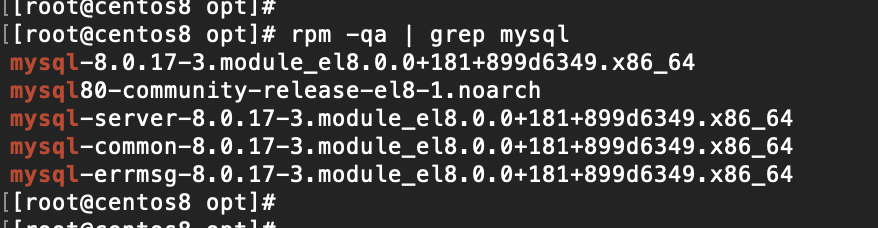
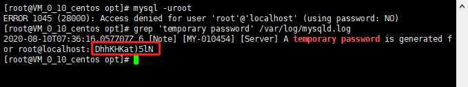
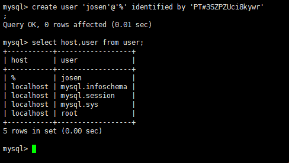
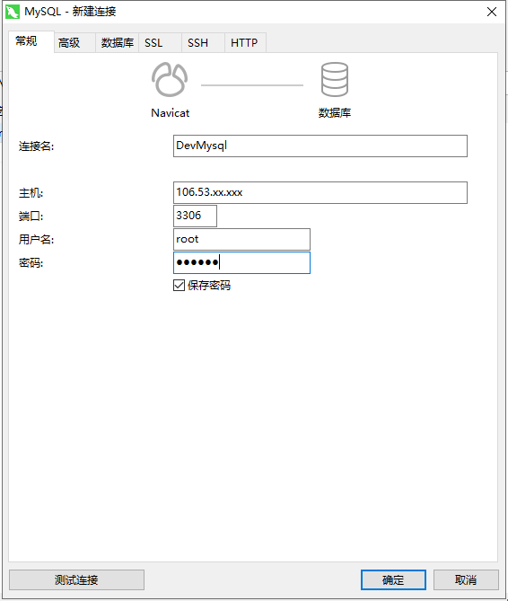

## Centos快速安装mysql

#### 1、下载RPM包

查看Mysql指定RPM包版本： http://repo.mysql.com/ 

```
# mysql version=5.6
wget http://repo.mysql.com/mysql-community-release-el7-5.noarch.rpm
# mysql version=8.0
wget https://dev.mysql.com/get/mysql80-community-release-el7-1.noarch.rpm
```

安装wget（已安装忽略）

```
yum -y install wget
```

#### 2、 安装rpm包

安装mysql-community-release-el7-5包

```
rpm -ivh mysql-community-release-el7-5.noarch.rpm
```

#### 3、安装mysql-server

```
yum install mysql-server
```

#### 4、查看是否安装成功

```
rpm -qa|grep mysql
```




Mysql目录

```tcl
# 相关命令
/usr/bin 

# 配置文件目录
/usr/share/mysql 

# 数据库文件存放目录
/var/lib/mysql 

# mysql启动配置文件
/etc/my.cnf.d 

# mysql客户端配置文件
 client.cnf 

# mysql守护进程配置文件
 mysql-server.cnf 

# 默认权限授权配置文件
 mysql-default-authentication-plugin.cnf 
```

#### 5、Centos7 操作Mysql命令

> Tip：Centos6使用service操作

```tcl
# 启动
systemctl start mysqld

# 初始化mysql
mysqld --initialize

# 开启自启动
systemctl enable mysqld 

# 重启
systemctl reload mysqld

# 关闭服务
systemctl stop mysqld

# 进入mysql交互
mysql -uroot
```


#### 6、重置Mysql登录密码

```tcl
mysql -uroot

# 报错：
ERROR 1045 (28000): Access denied for user 'root'@'localhost' (using password: NO)
```


输入以下指令生成随机密码，通过该密码登录mysql

```tcl
grep 'temporary password' /var/log/mysqld.log

# 使用密码方式登录mysql
mysql -u root -p
> Enter password: DhhkHKat)5lN
```




上面生成的随机密码只是临时的，登录进去后必须重置密码才能正常使用

<font color=red>【Tip：重置的密码强度要求比较高，可以使用MD5随机密码生成一个带特殊字符的密码】</font>

```tcl
# 重置密码
mysql> alter user 'root'@'localhost' identified by 'strong password';
Query OK, 0 rows affected (0.01 sec)

# 弱密码报错信息
# ERROR 1819 (HY000): Your password does not satisfy the current policy requirements
```

#### 7、本地远程连接Mysql

##### a. 添加一个用户，本地通过该用户远程连接mysql

```tcl
use mysql
# 'username'@'host' identified by 'password'
# % = 通配符，支持从任意远程主机登录
create user 'josen'@'%' identified by 'strong password';
```




##### b. 为该用户添加权限

```tcl
# ALL PRIVILEGES = 所有权限
# *.* = 全局
GRANT ALL PRIVILEGES ON * . * TO 'josen'@'%';
```

------

**<font color="green">-配置参数说明-</font>**

配置用户权限参数：

```
ALTER: 修改表和索引
CREATE: 创建数据库和表
DELETE: 删除表中已有的记录
DROP: 抛弃(删除)数据库和表
INDEX: 创建或抛弃索引
INSERT: 向表中插入新行
REFERENCE:未使用
SELECT: 检索表中的记录
UPDATE: 修改现存表记录
FILE: 读或写服务器上的文件
PROCESS: 查看服务器中执行的线程信息或杀死线程
RELOAD: 重载授权表或清空日志、主机缓存或表缓存
SHUTDOWN: 关闭服务器
ALL: 所有权限,ALL PRIVILEGES同义词
USAGE: 特殊的 “无权限” 权限
```

指定该用户操作数据库和表的范围

```
*.*：             	 全局
database.*：      	 指定数据库所有表
database.tableName：  指定数据表
```

##### c. 刷新mysql权限，使添加的权限生效

```
FLUSH   PRIVILEGES;
```

##### d. 防火墙开放3306端口

```
# 开放3306端口
firewall-cmd --add-port=3306/tcp --permanent

# 重启防火墙
systemctl restart firewalld.service

# 查看已开放端口列表
firewall-cmd --list-all
```

##### e. 本地连接远程服务器



