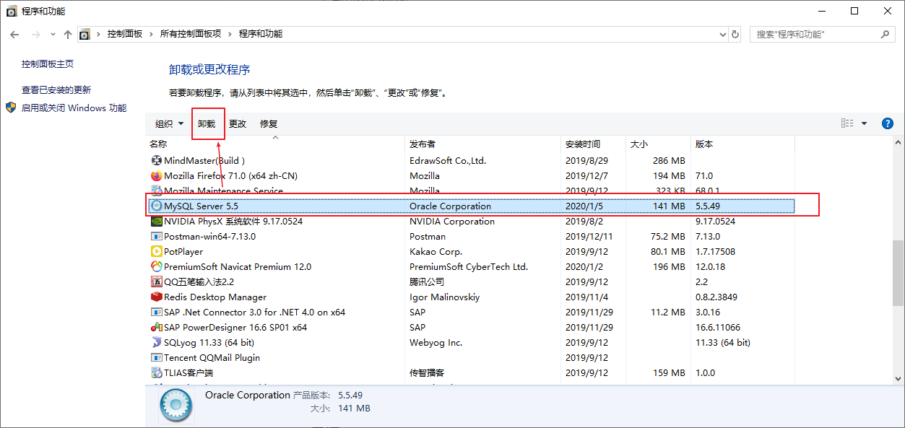

# MySql基础-课堂笔记

> 电影: 《当幸福来敲门》 《怦然心动》
>
> 书：《平凡的世界》《郭的刚好》
>
> Java的书：
>
> ​	核心数据卷1,2
>
> ​	深入理解JVM
>
> ​	并发编程的艺术
>
> ​	重构：改善既有的代码...

## 一、数据库的介绍

### 目标

* 理解为什么要有数据库
* 了解几种常见的数据库

### 讲解

#### 1. 什么是数据库

- 数据存储的技术有：
  - List、Map存储：不能持久化存储
  - 文件存储：存储的格式不统一，读取不方便，操作麻烦
- 数据库：存储数据的仓库，本质是一个文件系统。可以结构化的存储数据，方便的进行数据的增、删、改、查。

#### 2. 常见的数据库

- SQLServer：Microsoft公司的收费的、中型数据库软件。.net  c#
- Oracle：Oracle公司的收费的、高性能的、大型数据库软件。
- MySql：Oracle公司的免费的、小型数据库软件。被Oracle收购, 开始收费
- DB2：IBM公司的收费的、稳定的、大型数据库软件。
- Sybase：已经很少使用了，但是它提供了一个专业的数据库建模工具：PowerDesigner

### 小结

* 理解为什么要有数据库
  * 数据库存储数据，优点是：持久化存储，格式统一，方便增、删、改、查
  * 数据库本质是： 文件系统
* 常见的数据库：
  * MySql：Oracle的免费/收费的 小型数据库软件


## 二、MySql的安装和使用

### 1. MySql卸载与安装

#### 目标

MySql的安装和使用

#### 步骤

* 能够卸载MySql软件
* 能够安装配置MySql软件

#### 讲解

##### 1. MySql卸载

1. 停止MySql服务
   - 打开 服务管理窗口：`windows+r`，输入`services.msc`回车
   
     
   
   - 找到MySQL，右键停止
   
     
2. 卸载MySql软件
   - 打开控制面板：`windows+r`，输入`control`回车，打开控制面板，找到程序和功能 窗口
   
   - 找到MySql软件，双击卸载掉
   
     
3. 清理MySql残留
   - 删除安装目录：安装在哪，就把哪个文件夹删除掉
   - 删除数据目录：默认在`C:\programData\`下，删除MySql文件夹

##### 2. MySql安装

- 参考安装文件
- 注意：
  - 要勾选`Enable strict Mode`，启动语法的严谨模式
  - 字符集要设置成`utf8`
  - 要勾选`Include Bin directory....`添加环境变量
  - root用户的密码，建议设置为`root`

#### 小结 

* 卸载：
  1. 停止mysql服务
  2. 卸载MySql
  3. 清除MySql残留目录
  4. 如果重新安装出问题了，卸载完成之后再清理注册表
* 安装：
  1. 端口 3306
  2. 字符集：utf8
  3. 启动严谨模式
  4. 添加环境变量
  5. 建议密码简单点`root`

### 2. MySql服务管理和登录

#### 目标

MySql的服务管理和登录

#### 步骤

* 启动和关闭MySql服务
* 登录MySql数据库

#### 讲解

##### MySql服务管理

必须启动MySql服务，才可以使用MySql。

使用**管理员模式**运行cmd，在cmd里输入命令：

- 启动MySql服务：`net start mysql`
- 关闭MySql服务：`net stop mysql`


##### 登录MySql

###### 在dos窗口里通过命令登录

- 登录：`mysql -u用户名 -p密码`

  > 注意：-u后边没有空格， -p后边没有空格
  >
  > `mysql -u用户名 -p密码 [-hip地址 -P端口]`
  >
  > 

- 退出：`exit`  或者 `quit`

###### 使用客户端软件登录

- 安装过程，略

#### 小结 

* 管理员使用cmd，启动MySql服务：`net start mysql`
* 管理员使用cmd，关闭MySql服务：`net stop mysql`
* cmd连接MySql：`mysql -uroot -proot [-h127.0.0.1 -P3306]`
* 使用navicat连接MySql

## 三、SQL语句介绍

### 1. MySql的数据库结构

#### 目标

* 理解MySql的结构
* 了解MySql相关的概念

#### 讲解


* 相关的概念：
  * database：数据库，MySql里可以有多个database
  * table：表，一个database里可以有多个table
    * 记录：表里每一行/每一条数据，称为一条记录
  * column：字段，一个table里可以有多个column

> 表中的一个字段, 对应的就是java中的一个成员变量
>
> 表中的一条数据/记录, 对应的就是java中的一个对象

#### 小结

* 客户端：cmd、navicat、Java代码
  * 在客户端输入SQL语句：操作数据库
* 服务端：
  * 数据库服务器：安装了数据库软件的电脑
  * DBMS：数据库管理系统，指的是MySql软件
  * database：存储数据的仓库，通常是每个系统有一个database
  * table：存储数据的表
  * column：字段，表里的每一列叫字段
  * 记录：表里的每一行叫一条记录
* 一个DBMS可以管理多个database；一个database里可以有多张table；一张table里可以有多个 字段和多个记录

### 2. 什么是SQL

#### 目标

* 了解SQL的概念
* 能说出SQL的分类

#### 讲解

##### 什么是SQL

- SQL：Structure Query Language（结构化查询语言）,通过sql操作数据库(操作数据库,操作表,
  操作数据)
- SQL被美国国家标准局（ANSI）确定为关系型数据库语言的美国标准，后来被国际化标准组织
  （ISO）采纳为关系数据库语言的国际标准
- SQL规范：各数据库厂商(MySql,oracle,sql server)都支持ISO的SQL标准。
- SQL方言：各数据库厂商在标准的基础上做了自己的扩展。 各个数据库自己特定的语法

##### SQL分类

- **DDL**：DataBase Definition Language，数据定义语言。用来定义数据库结构，比如：库、表等等, 
  - create alter drop  [database|table]
- **DML**：DataBase Manipulation Lanaguage，数据操作语言。用来增、删、改数据的
  - insert into , delete from, update ... set ... where 
- **DQL**：DataBase Query Lanaguage，数据查询语言。用来查询数据的
  - select 
- DCL：DataBase Controll Lanaguage，数据控制语言。DBA使用的，进行权限管理
  - DBA：DataBase Administrator，数据库管理员

#### 小结

* SQL：结构化查询语言，用于操作数据库的
* 分类：
  * DDL：数据定义语言，用于定义database、table
  * DML：数据操作语言，用于增、删、改数据的
  * **DQL**：数据查询语言，用于查询数据的
  * DCL：数据控制语言，DBA使用进行权限控制的

## 四、SQL操作MySql【重点】

### 1 DDL语句【多写】

#### 1.1 DDL操作库database 

##### 目标

* 能够使用DDL管理database

##### 分析

* 管理database，常用的有：
  * 创建database
  * 查看database
  * 修改database
  * 使用database
  * 删除database

##### 讲解

###### 语法

* 创建库：`create database [if not exists] 库名称 [character set 字符集]`
* 查询所有库：`show databases`
* 查看一个库的创建信息：`show create database 库名称`
* 修改库：`alter database 库名称 [default] character set 字符集`
* 切换库/使用库：`use 库名称`
* 查看现在在哪个库里：`select database()`
* 删除库：`drop database 库名称`

```mysql
-- 1. 创建库：名称为day01，字符集为gbk的数据库
-- create database [if not exists] 数据库名字 [character set 字符集];
create database if not exists day01;
create database day01_1 character set gbk;

-- 2. 查看库：
--    查询所有库
--    show databases
show databases;
--    查看库的创建信息：
--    show create database 数据库名
show create database day01;
show create database day01_1;
-- 3. 修改库： 不建议修改字符集
--    修改库的字符集：alter database 数据库名 character set 
alter database day01_1 character set utf8;

-- 4. 切换库/使用库
--     切换库：use 数据库名
use day01;

--     查看当前使用的哪个库：select database();
select database();

-- 5. 删除库
--    删除库：drop database [if exists] 数据库名
drop database if exists day01_1;
```

###### 练习

```mysql
--    ****************练习********************
-- 1. 创建一个库，名称为：heima。字符集默认
create database heima;
-- 2. 如果库heima不存在，就创建。
create database if not exists heima;
-- 3. 创建一个库，名称为itheima，字符集gbk
create database itheima character set gbk;
-- 4. 如果库itheima不存在，就创建，并且指定字符集为gbk
create database if not exists itheima character set gbk;
-- 5. 查询有哪些库
show databases;
-- 6. 查看heima库的创建信息
show create database heima;
show create database itheima;
-- 7. 把itheima库的字符集修改为utf8（不建议修改字符集）
alter database itheima character set utf8;
-- 8. 删除库itheima
drop database itheima;
-- 9. 使用库heima
use heima;
-- 10. 查询现在使用的是哪个库
select database();
```

##### 小结


#### 1.2 DDL操作表table

##### 目标

* 能够使用DDL语句管理table

##### 分析

* MySql的数据类型介绍

* 管理table，常用的有：
  * 创建table
  * 查看table
  * 修改table
  * 删除table

##### 讲解

###### MySql的数据类型

| 数据类型    | 说明                                               | 对应Java类型            |
| ----------- | -------------------------------------------------- | ----------------------- |
| int         | 整数类型，占4字节                                  | int, Integer            |
| double(m,n) | 小数类型，占8字节。总长度m，小数长度n。double(5,2) | double, Double          |
| varchar(n)  | 可变长度字符串。varchar(10)，存储"ab"，占2个字符   | String                  |
| char(n)     | 固定长度字符串。char(2)，存储"ab"，占2个字符       | String                  |
| date        | 日期类型。格式：yyyy-MM-dd                         | Date                    |
| datetime    | 日期时间类型。格式：yyyy-MM-dd HH:mm:ss            | java.sql.Timestamp,Date |

> 给指定数据类型赋值的时候, 除了数字类型可以直接写值, 其他所有类型都需要使用`单引号, 双引号`, 建议使用单引号.

###### DDL操作table

* 语法

  * 创建表：`create table 表名称(字段名 类型 [约束], 字段名 类型 [约束], ...)`
  * 查看所有表：`show tables`
  * 查看表结构：`desc 表名称`
  * 查看表创建信息：`show create table 表名称`
  * 修改表：
    * 重命名表：`rename table 原名称 to 新名称`
    * 添加字段：`alter table 表名称 add 字段名 类型`
    * 修改字段类型：`alter table 表名称 modify 字段名 新类型`
    * 修改字段名称：`alter table 表名称 change 原字段名 新字段名 类型`
    * 删除字段：`alter table drop 字段名`
  * 删除表：`drop table 表名称`

  ```mysql
  --  一定要先选择一个库database之后，再操作table  ---
  select database();
  use heima;
  -- 1. 创建表：创建用户表，编号、姓名、年龄、性别、生日
  -- java习惯: int id;   MySQL : id int
  -- create table 表名 (字段名 字段类型,字段名 字段类型,字段名 字段类型,... )  
  create table user1 (
  	id int,
  	name varchar(20),
  	age int,
  	sex varchar(1),
  	birthday date
  );
  
  -- 2. 查看表：
  --    查看所有表：show tables;
  show tables;
  --    查看表创建信息： show create table 表名
  show create table user1;
  --    查看表结构： desc 表名;
  desc user2;
  
  -- 创建和已存在表相同结构的另一张表
  -- create table 新表名 like 旧表名
  create table user2 like user1;
  
  -- 3. 修改表
  --    重命名表：rename table 旧表名 to 新表名;
  rename table user1 to user111;
  --    (以下四个操作, 都属于表的修改, 所以都用 alter )
  --    增加字段：alter table 表名 add 新字段名 新字段类型;
  alter table user2 add salary double(10, 2);
  --    修改字段类型：alter table 表名 modify 字段名 新字段类型;
  alter table user2 modify sex varchar(5);
  --    修改字段名称：alter table 表名 change 旧字段名 新字段名 新字段类型;
  alter table user2 change sex gender char(1);
  --    删除字段：alter table 表名 drop 字段名;
  alter table user2 drop salary;
  
  -- 4. 删除表：
  drop table user2;
  ```
  
  
  
* 练习

  ```mysql
  -- ************************练习*******************************
  -- 1. 在heima库里，创建一张表：student。要求有字段：学号、姓名、年龄、性别、生日、地址
  create table student (
  	id int,
  	name varchar(20),
  	age int,
  	sex varchar(1),
  	birthday date,
  	address varchar(50)
  );
  -- 2. 查询当前库里有哪些表
  show tables;
  -- 3. 查看表student的创建信息
  show create table student;
  -- 4. 查看表student的结构
  desc student;
  -- 5. 删除表student2
  create table student2 like student;
  drop table student2;
  
  -- 6. 给student表添加列：英语成绩 english  int，  工资 salary double
  alter table student add english int;
  alter table student add salary double;
  -- 7. 修改student表：把salary的类型改为int
  alter table student modify salary int;
  -- 8. 修改student表：把english重命名为math
  alter table student change english math double;
  -- 9. 修改student表：删除address列
  alter table student drop address;
  -- 10. 把student表重命名为：students
  rename table student to students;
  ```
  

##### 小结

* 数据库类型：
  * 整数类型：int
  * 双精度：double(5, 2)，长度是5，小数有2位
  * 固定长度字符串：char(10)
  * 可变长度字符串：varchar(10)
  * 日期类型：date
  * 日期时间类型：datetime
* 操作table：
  * 创建table`create table 表名称(字段名 类型, 字段名 类型, ...) `
  * 查看table
    * 查看所有表：`show tables`
    * 查看表创建信息：`show create table 表名称`
    * 查看表结构：`desc 表名称`
  * 修改table
    * 重命名表：`rename table 表名称 to 新名称`
    * 添加字段：`alter table 表名称 add 字段名 类型;`
    * 修改字段类型：`alter table 表名称 modify 字段名 新类型`
    * 修改字段名称：`alter table 表名称 change 原字段 新字段名 新类型`
    * 删除字段：`alter table 表名称 drop 字段名`
  * 删除表：`drop table 表名称`


### 2 DML语句【重点】

##### 目标

* 能够使用DML，管理table里的数据

##### 分析

* DML的操作包含：
  * 插入数据/记录
  * 修改数据/记录
  * 删除数据/记录

##### 讲解

###### 语法

* 插入数据：MySql可以以字符串形式插入一切类型的数据
  * 插入所有字段：`insert into 表名称 values (值1, 值2, ...)`
  
    > 注意：
    >
    > * 值的个数必须等于表里字段的个数
    > * 值的顺序必须和表里字段的顺序一样
  
  * 插入指定字段：`insert into 表名称 (字段名1, 字段名2, ..., 字段名n) values (值1, 值2, ..., 值n)`
  
    > 注意：
    >
    > * 值的个数 必须 和前边声明的字段的个数一样
    > * 值的顺序 必须 和前边声明的字段的顺序一样
* 修改数据
  
  * `update 表名称 set 字段名1=值1, 字段名2=值2,..., 字段名n=值n [where 条件]`
* 删除数据
  * 删除符合条件的数据：`delete from 表名称 [where 条件]`
  * 摧毁重建表：`truncate table 表名称`

> delete  : 删除表, 是一行一行的删除
>
> ​			   速度慢, 可以还原
>
> truncate: 先把整张表都删掉, 然后创建一张表结构相同的新表
>
> ​				速度快, 不能还原

```mysql
-- DML操作表
-- 插入数据: 全部字段
insert into user values (1, '张三', 23, '男', '2001-10-25');
insert into user values (2, '李四', 24, '女', '2001-10-25');
insert into user values (3, '王五', 25, '男', '2001-10-25');
insert into user values (4, '赵六', 26, '男', '2001-10-25');
-- 插入数据: 指定字段, 没有指定的字段是null(默认值)
insert into user (id, name, age) values (2, '李四', 24);

-- 修改数据 
-- update 表名 set 字段名=字段值  where 条件
update user set age = 25 where  id = 1;

-- 删除数据
-- delete from 表名 : 把表中的数据都删了
-- delete from 表名 where 条件
delete from user where id >= 3;

truncate table user;
```

###### 练习

```mysql
-- 1. 向students表里添加数据：给表所有字段都设置值
INSERT INTO students VALUES (1, '张三', 23, '男', '2001-5-8', 30, 3000);
-- 2. 向students表里添加数据：只插入id、name、age
INSERT INTO students (id, `name`, age) VALUES (2, '李四', 24);
-- 3. 修改students表里id为1的数据：修改salary为20000
UPDATE students SET salary = 20000 WHERE id = 1;
-- 4. 修改students表里id为1的数据：修改性别为女，修改math为60
UPDATE students SET sex = '女', math = 60 WHERE id = 1;
-- 5. 删除students表里id为1的数据
DELETE FROM students WHERE id = 1;
-- 6. 删除students表里所有数据
DELETE FROM students;
```

##### 小结

* 插入数据：
  * 插入所有字段：`insert into 表名称 values (值1,值2,...,值n)`
  * 插入指定字段：`insert into 表名称 (字段1,字段2,..,字段n) values (值1,值2,...,值n)`
* 修改数据：
  * `update 表名称 set 字段1=值1, 字段2=值2,..,字段n= 值n where 条件`
* 删除数据：
  * `delete from 表名称 where 条件`
  * `truncate table 表名称`

### 3 DQL语句【重点】

```mysql
CREATE TABLE students ( 
id int, 
name varchar(20), 
age int, 
sex varchar(5), 
birthday date,
math int, 
english int,
address varchar(100), 
dept varchar(10),
salary double(8, 2));


insert into students values (1, '张三', 23, '男', '1990-01-01', 60, 81, '深圳', '财务部', 10000);
insert into students values (2, '张三丰', 27, '男', '1990-01-01', 61, 82, '香港', '市场部', 10500);
insert into students values (3, '李四', 20, '女', '1990-01-01', 62, 73, '北京', '销售部', 16000);
insert into students values (4, '王五', 20, '男', '1990-01-01', 63, 84, '香港', '行政部', null);
insert into students values (5, '赵六', 38, '女', '1990-01-01', 64, 75, '深圳', '销售部', 21000);
insert into students values (6, '周琦', 31, '男', '1990-01-01', 65, 76, '香港', '销售部', null);
insert into students values (7, '张翠山', 30, '男', '1990-01-01', 67, 66, '深圳', '财务部', 24000);
insert into students values (8, '张无忌', 30, '男', '1990-01-01', 67, 88, '香港', '销售部', 17000);
insert into students values (9, '王ss', 30, '女', '1990-01-01', 68, 89, '深圳', '行政部', 22000);
insert into students values (10, '王大柱', 3, '男', '1990-01-01', 69, 80, '北京', '销售部', 9000);
insert into students values (11, '李三刚', 14, '男', '1990-01-01', 70, 61, '北京', '市场部', 8000);
insert into students values (12, '李玉刚', 50, '女', '1990-01-01', 71, 92, '上海', '销售部', 24000);
insert into students values (13, '张三三', 60, '女', '1990-01-01', 72, 53, '上海', '行政部', null);
insert into students values (14, '迪丽热巴', 65, '女', '1990-01-01', 73, 94, '广州', '市场部', 11300);
insert into students values (15, '古力娜扎', 20, '男', '1990-01-01', null, 80, '北京', '销售部', 9000);
insert into students values (16, '欧阳娜娜', 14, '男', '1990-01-01', null, 61, '珠海', '行政部', 8000);
insert into students values (17, '娜可露露', 50, '女', '1990-01-01', 71, null, '澳门', '市场部', 24000);
insert into students values (18, '马可波罗', 60, '女', '1990-01-01', null, null, '澳门', '财务部', 17700);
insert into students values (19, '罗马尼亚', 65, '女', '1990-01-01', 73, 94, '新加坡', '市场部', null);
insert into students values (20, '张三', 23, '男', '1990-01-01', 60, 81, '深圳', '财务部', 10000);
```


#### 3.1 简单查询

##### 目标

* 能够使用DQL，简单查询table里的数据

##### 讲解

###### 语法

* 基本语法：`select [distinct] 字段1,字段2..|* from 表名称`
  * 查询并处理Null值：`ifnull(字段, 默认值)`
  
    * 语义: 如果给定**字段**是null, 我们就把null当成**默认值**
    * 例如: ifnull(age, 100) : 如果age字段的值为null, 把age当成100
  
  * 查询并进行运算：`+,-,*,/`
  
  * 查询并起别名：`字段名 [as] 别名`
  
* 去重查询：`distinct`
  
    > distinct后边所有的字段值都一样，才是重复值，是要去掉的。
  
* 注意：查询操作，不会对表里的数据有任何的影响

```mysql
--  JDBC -> ResultSet -> 遍历结果集, 获取到每一条数据 -> 封装到Student对象

-- 1. 查询students表里所有字段的值
select * from students;
-- 2. 查询students表里所有用户的姓名
select name from students;
-- 3. 查询students表里每个用户的姓名和工资。如果工资为null，按0处理
select name, ifnull(salary, 0) from students;
-- 4. 查询students表里每个用户的姓名和  总收入：工资+奖金5000
select name, salary + 5000 from students;
-- 对工资为null进行判断

-- 5. 查询students表里每个用户的姓名和  总收入（字段显示成“总收入”）
select name,  IFNULL(salary,0) + 5000 '总收入' from students;
-- 给表起别名(多表)

-- 6. 去重查询students表里每个用户所属的部门
select distinct dept from students;
```


###### 练习

```mysql
-- ************************练习***********************************
-- 1. 查询students表里所有数据
select * from students;
-- 2. 查询students里所有的姓名和年龄 
select name, age from students;
-- 3. 查询并处理null值：查询每个学生的姓名 和 成绩（英语和数学成绩，如果成绩为null，认为是0）
select name, IFNULL(english,0), IFNULL(math,0)from students;
-- 4. 查询students里每个学生的总成绩（如果成绩为null，认为是0）
select name, IFNULL(english,0) + IFNULL(math,0) from students;
-- 5. 查询并起别名
select name, IFNULL(english,0) + IFNULL(math,0) '总成绩' from students;
-- 6. 查询students表里所有的性别
select distinct sex from students;
```

##### 小结

*  查询所有字段的值：`select * from 表名称`
* 查询指定字段的值：`select 字段1,字段2,...,字段n from 表名称`
* 查询并处理null值：`select ifnull(字段,默认值) from 表名称`
* 查询并进行运算：`select 字段1+字段2, 字段3-字段4 from 表名称`
* 查询并起别名：`select 字段1 别名1,  字段2 别名2,.., 字段n 别名n from 表名称`
* 查询并去重：`select distinct 字段1,字段2,...,字段n from 表名称`

#### 3.2 条件查询

##### 目标

* 能够使用DQL进行条件查询

##### 分析

* 单条件查询
  * 范围查询
  * 模糊查询
* 多条件查询

##### 讲解

###### 语法

* 条件查询语法：`select * from 表名称 where 条件`
  * 条件运算符有：
    * `>, <, >=, <=, =, <>`   
      * `<>`   => 不等于  
      * `!=`  => 不等于
    * `is null` 和 `is not null`
  * 模糊查询：`like '表达式'`， `not like '表达式'`。在表达式里可以写：
    - `_`：一个任意字符
    - `%`：任意个任意字符
  * 范围查询：
    - `between 开始值 and 结束值`，包含开始值和结束值,   开始值 < 结束值
    - `in(值1, 值2, ....)` : 集合查询 
  * 多条件连接符有：`and, or`   `not(条件)`  

```mysql
-- 1. 判断条件：查询年龄大于25岁的学生
select * from students where age > 25;
-- 2. 判断条件：查询年龄大于等于20岁的学生
select * from students where age >= 20;
-- 3. 判断条件：查询工资不为空的学生
select * from students where salary is not null;
-- 4. 模糊查询：查询姓名以“王”开头的学生
select * from students where name like '王%'; -- % :任意字符的任意个
-- 5. 模糊查询：查询姓名以“王”开头的，并且名称为两个字的学生
select * from students where name like '王_';
-- 6. 范围查询：查询工资在10000到100000之间的学生
select * from students where salary >= 10000 and salary <= 100000;
select * from students where salary between 10000 and 100000;
-- 7. 集合查询：查询财务部和销售部的学生
select * from students where dept= '财务部' or dept = '销售部';
select * from students where dept IN('财务部', '销售部');
-- 8. 查询年龄大于等于20，并且工资大于等于10000的学生
select * from students where age >= 20 and salary >= 10000;
-- 9. 查询年龄小于30岁，或者性别为男性的学生
select * from students where age < 30 or sex = '男';
-- 10. 查询不是财务部的学生
select * from students where dept != '财务部';
select * from students where not(dept = '财务部');
```

###### 练习

* 单条件查询

```sql
-- 1. 单条件查询
-- 1.1 查询所有的男同学
-- 1.2 查询年龄在25岁以上的同学
-- 1.3 查询地址不是香港的同学
-- 1.4 查询英语成绩为空的同学
```

* 多条件

```sql
-- 2. 多条件查询
-- 2.1 查询年龄大于25岁的男同学
-- 2.2 查询年龄小于25岁的同学，或者英语成绩大于80的同学
-- 2.3 查询年龄不大于25岁的同学
```

* 范围条件

```sql
-- 3. 范围查询
-- 3.1 查询年龄在20到50之间（包含20和50）
-- 3.2 查询地址是深圳和香港的同学
```

* 模糊查询

```sql
-- 4. 模糊查询
-- 4.1 查询所有姓王的同学
-- 4.2 查询姓王的、名称为两个字的同学
-- 4.3 查询姓名里含有“三”字的同学
-- 4.4 查询姓名为两个字的同学
-- 4.5 查询姓名里不包含“三”字的同学
```

##### 小结

* 单条件的：
  * 条件判断：`>, <, >=, <=, =, <>`
  * 判空：`is null`    `is not null`
  * 模糊查询：`like '张%'`， `like '张_'`  `not like '张%'`， `not like '张_'`  
  * 范围查询：`between 开始值 and 结束值`， `in(值1,  值2,.., 值n)`
* 多条件的：
  * `and`：并且，所有条件都必须符合
  * `or`：或者，任意条件满足即可
  * `not`：非，排除结果不要

#### 3.3 排序查询

##### 目标

* 掌握DQL的排序查询

##### 讲解

###### 语法

* `order by 排序字段 排序规则, 排序字段2 排序规则2, ...`
* 排序规则有：
  - `ASC`：升序，从小到大，默认的
  - `DESC`：降序，从大到小

```mysql
-- 1. 排序查询：order by 排序字段 排序规则
-- 2. 排序查询：按照年龄从小到大排序，如果年龄相同，就按照工资从高到低排序
```

###### 练习

```mysql
-- 排序查询
-- 1. 排序查询：order by 排序字段 排序规则, 以年龄从大到小
select * from students order by age;

-- 2. 排序查询：按照年龄从小到大排序，如果年龄相同，就按照工资从高到低排序
select * from students order by age , salary desc;

-- 5. 排序查询
-- 5.1 查询所有的同学，按照年龄从小到大排列显示
select * from students order by age;
-- 5.2 查询所有的同学，按照年龄从小到大排列显示；如果年龄相同，按照数学成绩从低到高排序
select * from students order by age , math;
-- 5.3 查询所有的男同学，按照年龄从小到大排列显示；如果年龄相同，按照数学成绩从高到低排序
select * from students where sex = '男' order by age , math desc ;
```

##### 小结

* `select *|字段 from 表名称 [where 条件] order by 排序字段 排序规则, 排序字段 排序规则`
* 排序规则：
  * asc：升序
  * desc：降序

#### 3.4 聚合函数

##### 目标

* 掌握聚合函数的作用和使用

##### 讲解

###### 语法

* 聚合函数：用于进行列数据统计的。常用的聚合函数有：
  * `count(字段)`：统计数量
  * `sum(字段)`：求和
  * `avg(字段)`：求平均值
  * `max(字段)`：求最大值
  * `min(字段)`：求最小值
* 注意：所有聚合函数会忽略null值

###### 练习

```mysql
-- 聚合函数
-- 6. 聚合函数
-- 6.1 查询学生表里的数量, 共有多少个学生数据
select count(*) from students;
select count(ifnull(math, 0)) from students;
-- 6.2 查询所有学生的年龄总和
select sum(age) from students;
-- 6.3 查询所有学生的平均年龄
select avg(age) from students;
-- 6.4 查询最大年龄
select max(age) from students;
-- 6.5 查询最小年龄
select min(age) from students;
```

##### 小结

* 统计数量：`count()`
* 求和：`sum()`
* 求平均数：`avg()`
* 求最大值：`max()`
* 求最小值：`min()`
* 注意：所有聚合函数会忽略null值

#### 3.5 分组查询

##### 目标

* 能够实现分组查询
* 理解where和having的区别

##### 讲解

###### 语法

- 语法：`group by 分组字段 [having 分组后的过滤条件]`
- 注意：select后边，只能跟分组的字段，或者聚合函数。不能查询与分组无关的字段
- where和having的区别：
  - where在分组前执行；having在分组后执行
  - where过滤原始表的数据；having过滤分组后的数据
  - where里不要写聚合函数；having里可以写聚合函数
- 分组查询的顺序：
  - 使用where对原始表进行过滤
  - 根据分组字段进行分组统计，得到分组后的结果
  - 使用having对分组后的结果进行过滤

```mysql
-- 分组查询  group by
-- 以性别进行分组 -> 查询到该组中的第一条数据
select * from students group by sex;
-- 以性别进行分组, 查询每一组有多少个  -> 只查分组后的结果, 显示不人性化, 以什么为分组, 就把什么显示出来(当做查询的字段)
select count(*) from students group by sex;
select sex, count(*) from students group by sex;


--    分别统计男性用户的数量，和女性用户的数量
select sex, count(*) from students group by sex;
--    分别统计每个部门的用户数量
select dept, count(*) from students group by dept;
--    分别统计每个部门的男性用户数量
select dept, count(*) from students where sex = '男' group by dept ;
select * from students where sex = '男' and dept = '市场部';
--    分别统计每个部门的用户数量，只要数量大于3的
select dept, count(*) from students  group by dept having count(*) > 3;


-- 注意：分组查询的select，只能select 分组字段，或者聚合函数；不能select 和分组无关的字段
```

###### 练习

```mysql
-- 7. 分组查询
-- 7.1 分组统计男生和女生的数量
select sex, count(*) from students group by sex;
-- 7.2 分组统计每个地方的学生数量
select address, count(*) from students group by address;
-- 7.3 分组统计每个地方的学生数量，只要数量大于1的
select address, count(*) from students group by address having count(*) > 1;
-- 7.4 分组统计每个地方的男生数量

-- 7.5 分组统计每个地方的男生数量，只要数量大于1的
select address, count(*) from students where sex = '男' group by address having count(*) > 1;
```

##### 小结

* `select 分组字段,聚合函数 from 表名称 where 过滤 group by 分组字段 having 分组后的过滤条件`
* where和having的区别
  * 过滤的内容：where过滤原始表；having过滤分组后的结果
  * 过滤的时机：where先过滤（在分组前）；having后过滤（在分组后）
  * 过滤的写法：where 不能跟聚合函数；having后可以跟聚合函数

#### 3.6 分页查询

##### 目标

* 能够实现分页查询

##### 讲解

###### 语法

* 语法：`limit 起始索引，查询数量`

```mysql
-- 分页

-- 1. 分页查询  limit 起始索引, 查询数量。  
-- 起始索引: (页数 - 1) * 数量
--    查询用户，每页3条，要查询第一页
select * from students limit 0, 3;
--    查询用户，每页3条，要查询第二页
select * from students limit 3, 3;
--    查询用户，每页3条，要查询第三页
select * from students limit 6, 3;
```

###### 练习

```mysql
-- 8. 分页查询：每页3条
-- 8.1 查询第1页的数据  
-- 8.2 查询第2页的数据  
```

##### 小结

* `select * from 表名称 limit 起始索引, 查询数量`

#### 3.7 综合查询

```sql
-- 综合练习
-- 分组统计每个地方的男生数量，只要数量大于等于1的。查询结果按照。 每页2条，显示第1页
-- 每个地方: group by address
-- 男生 : where sex = '男'
-- 数量 : count(*)
-- 数量大于等于1 : having count(*) >= 1
-- 数量升序显示 : order by count(*)
-- 每页2条，显示第1页 : limit 0, 2;
select address, count(*) from students where sex = '男' group by address having count(*) >= 1 order by count(*) limit 0, 2;

-- select 字段|聚合函数 from 表名 where 条件 group by 分组字段 having 分组后的过滤条件 order by 排序字段 排序规则, 排序字段 排序规则 limit 索引, 数量;
```

* `select 字段|聚合 from 表名称 where 条件 group by 分组字段 having 分组后过滤 order by 排序字段 排序规则 limit 起始索引,查询数量`

## 五、MySql约束【理解】

### 目标

* 理解数据库约束的概念
* 能说出MySql的约束及其作用

### 分析

* MySql中约束有：
  * 主键约束
  * 唯一性约束
  * 非空约束
  * 默认值约束
  * 外键约束（大后天讲）

### 讲解

#### 1. 主键约束

- 主键：一张表里数据的唯一标识。原则上：每张表必须有主键，且只能有一个主键

  - 联合主键: 两个字段组成

- 主键约束(primary key)：

  - 作用：被主键约束的字段，值必须是非空、唯一
  - 语法：`primary key [auto_increment]`

    - 如果主键字段是整数，可以增加`auto_increment`，MySql会自动生成主键值：`1,2,3, ... +1`
    - 如果不是数字，不要增加`auto_increment`

- 主键字段效果演示：

  ```mysql
  -- 主键约束：被约束的字段值，必须非空、唯一
  
  -- 创建一张商品信息表。有字段：编号，名称，价格
  create table product(
  	id int PRIMARY key auto_increment,
  	pname varchar(100),
  	price double
  );
  
  -- 向product表里插入数据 
  insert into product values (1, '水杯', 59);
  -- 向product表里再插入数据：主键值还指定为1, 能否成功？
  -- 向product表里插入数据：主键值指定为null，能否成功？
  ```

#### 2. 唯一性约束

- 作用：唯一性约束的字段，值不能重复，但是可以为null
- 语法：`字段名 类型 unique`
- 唯一性约束效果演示：

```mysql
-- 唯一性约束：被唯一性约束的字段，值必须是唯一的，可以为null
drop table product;
create table product(
	id int primary key auto_increment,
	pname varchar(100) unique,
	price double
);
-- 向product表里插入数据
insert into product values (null, '键盘', 159);
-- 向product表里插入数据：商品名称还是 键盘，能否成功？
-- 向product表里插入数据：商品名称还是 空的，能否成功？
```

#### 3. 非空约束

- 作用：非空约束的字段，值不能为null
- 语法：`字段名 类型 not null`
- 非空约束效果演示：

```mysql
-- 非空约束
drop table product;
create table product(
	id int primary key auto_increment,
	pname varchar(100) unique not null,
	price double
);
-- 向product表里插入数据：商品名称是null，能否成功？
```

#### 4. 默认值约束

- 作用：默认值约束的字段，如果**不指定**值，取默认值（如果指定null值，值就是null，不取默认值）
- 语法：`字段名 类型 default 默认值`
- 默认值约束效果演示：

```mysql
-- 默认值约束
drop table product;
create table product(
	id int primary key auto_increment,
	pname varchar(100) unique not null,
	price double default 0
);
-- 向product表里插入数据：价格为null，有没有默认值？
-- 向product表里插入数据：不插入价格，有没有默认值？
```

### 小结

* 主键约束：
* 唯一性约束：
* 非空约束：
* 默认值约束：

## 附: dos窗口里中文乱码的处理

### 1. 临时方案

* 在执行SQL语句之前，先执行一条命令：`set names gbk;`
  * 告知MySql数据库，客户端使用的是gbk，请求MySql把数据以gbk的形式返回
* 再执行SQL语句，中文就不乱码了

### 2. 永久方案

* 找到MySql安装目录里的my.ini，打开并修改
* 找到`[mysql]`下边的`default-character-set=utf8`，改成：`default-character-set=gbk`
* 然后，重启MySql服务
