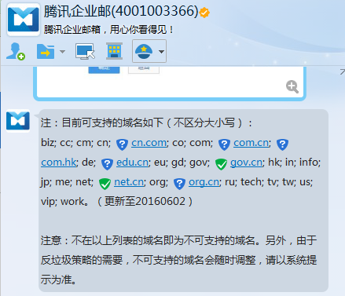
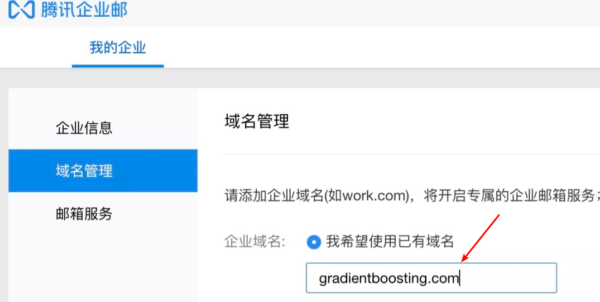
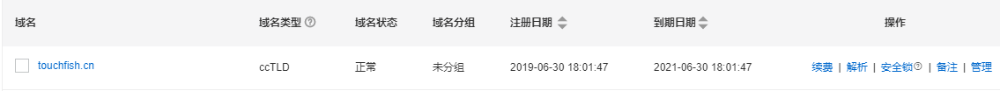
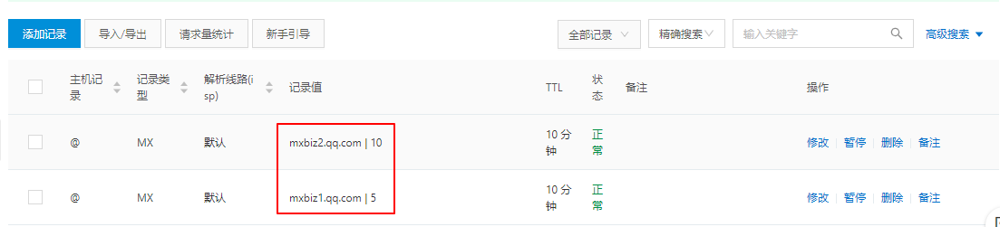
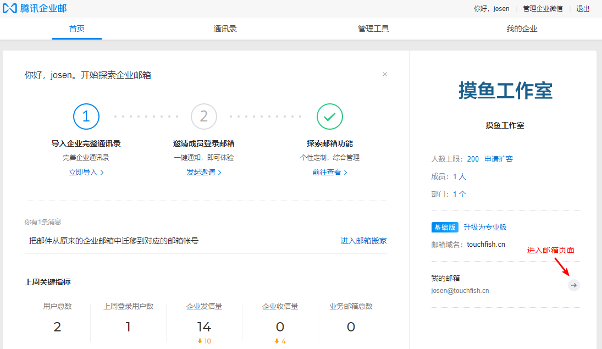
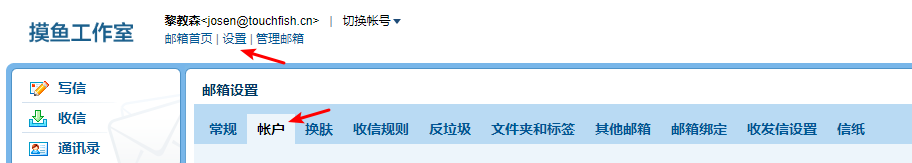
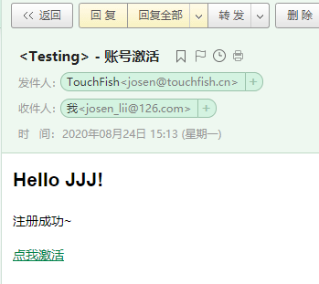

## 快速搭建专属域名邮箱


### 一、什么是域名邮箱

我们常用的通常是 `xxx@qq、xxx@163、xxx@126、xxx@gmail` 等结尾的邮箱地址，但是如果需要自定义一个属于自己域名的邮箱`（如：xxx@mydomain.com）`就需要自己动手搭建，**下面以使用<a href="   https://exmail.qq.com/" target=" _blank ">腾讯企业邮箱</a>进行搭建**；

> Tip： 搭建前需要拥有一个域名，如果没有可以选择<a href=" https://wanwang.aliyun.com/ " target="_blank">阿里云</a> 或<a href="  https://dnspod.cloud.tencent.com/ " target="_blank">腾讯云</a>购买一个域名。（腾讯企业邮箱有域名后缀要求，否则可能会造成无法正常使用，尽量注册图下后缀的域名）




### 二、创建腾讯企业邮箱

打开<a href="   https://exmail.qq.com/  " target="_blank">腾讯企业邮箱</a>网站，**选择基础版完成注册企业微信步骤**；

注册成功后，登录自己的企业邮箱，**到我的企业/域名管理页面中绑定自己购买的域名**




### 三、绑定域名解析

登录购买域名的服务商域名控制台，进入域名解析页面



**添加如下两条解析记录【 MX ：表示将域名指向邮箱服务器地址】**




完成域名解析后，再回到腾讯企业邮箱**通讯录页面新增成员**，创建的成员邮箱地址后缀即为注册的域名。

> 配置到这里基本上已经差不多了，后面就是进入到该新增成员的邮箱页面中设置邮箱密码，在Java代码中测试邮箱的发送功能；


### 四、在Java中调用邮件发送

#### 4.1 配置邮箱密码

进入邮箱页面



进入设置/账号页面，找到 **帐户安全 设置密码，该密码在Java中充当授权码来调用发送邮件** 。



#### 4.2 在Java中测试发送邮件

**在pom.xml添加以下jar包**

```xml
    <!-- https://mvnrepository.com/artifact/javax.mail/mail -->
    <dependency>
      <groupId>javax.mail</groupId>
      <artifactId>mail</artifactId>
      <version>1.4.7</version>
    </dependency>

    <!-- https://mvnrepository.com/artifact/com.sun.mail/javax.mail -->
    <dependency>
      <groupId>com.sun.mail</groupId>
      <artifactId>javax.mail</artifactId>
      <version>1.6.2</version>
    </dependency>
```


**MailUtils发送邮件工具类**

```java
import com.sun.mail.util.MailSSLSocketFactory;
import javax.mail.*;
import javax.mail.internet.InternetAddress;
import javax.mail.internet.MimeMessage;
import java.security.GeneralSecurityException;
import java.util.Properties;

/**
 * @ClassName MailUtils
 * @Description 发送邮件工具类
 * @Author Josen
 * @Create 2020/8/12 12:08
 */
public class MailUtils {
    private String email;// 收件人邮箱
    private String url;// 激活链接
    private String name; // 用户名
    // 腾讯企业邮箱服务器地址
    private static final String TX_COMPANY_HOST = "smtp.exmail.qq.com";
    // 你的企业邮箱地址邮箱地址（发件人）
    private static final String FROM_TX_COMPANY_MAIL = "name@domain.com";
    // 你的企业邮箱密码（即4.1设置的密码）
    private static final String TX_COMPANY_AUTH_CODE = "yourPassword";
    public MailUtils(){}
    public MailUtils(String email, String url, String name) {
        this.email = email;
        this.url = url;
        this.name = name;
    }
    public void sendMail() {

        String from = FROM_TX_COMPANY_MAIL;
        String host = TX_COMPANY_HOST;

        Properties properties = new Properties();
        properties.setProperty("mail.transport.protocol", "smtp");//协议
        properties.setProperty("mail.smtp.host", host);// 设置邮件服务器
        properties.setProperty("mail.smtp.auth", "true");// 打开认证
        properties.setProperty("mail.smtp.port", "465"); // 使用465端口

        //使用SSL，企业邮箱必需！
        //开启安全协议，如果出错显示类不存在，就更新mail的jar包
        MailSSLSocketFactory sf = null;
        try {
            sf = new MailSSLSocketFactory();
            sf.setTrustAllHosts(true);
        } catch (GeneralSecurityException e1) {
            e1.printStackTrace();
        }
        properties.put("mail.smtp.ssl.enable", "true");// 打开SSL
        properties.put("mail.smtp.ssl.socketFactory", sf);

        try {
            // 获取默认session对象
            Session session = Session.getDefaultInstance(properties, new Authenticator() {
                public PasswordAuthentication getPasswordAuthentication() {
                    return new PasswordAuthentication(FROM_TX_COMPANY_MAIL, TX_COMPANY_AUTH_CODE); // 发件人邮箱账号、授权码
                }
            });

            // 创建邮件对象
            Message message = new MimeMessage(session);
            // 设置发件人-TouchFish为邮箱的标题
            message.setFrom(new InternetAddress(from,"TouchFish"));
            // 设置接收人
            message.addRecipient(Message.RecipientType.TO, new InternetAddress(email));
            // 设置邮件主题
            message.setSubject("<Testing> - 账号激活");
            // 设置邮件内容

            String content = "<h2>Hello "+name+"!</h2></br></br>" +
                    "<p>注册成功~</p></br></br>" +
                    "<p><a href='"+url+"'>点我激活</a></p>";
            message.setContent(content, "text/html;charset=UTF-8");
            // 发送邮件
            Transport.send(message);
            System.out.println("邮件成功发送!");
        } catch (Exception e) {
            System.out.println("邮件发送失败!");
            e.printStackTrace();
        }
    }
}

```


**编写Test单元测试，调用MailUtils工具类发送邮件**

```java
public class TestMailUtil {
    @Test
    public void testing() {
        String str = UUID.randomUUID().toString();
        // 收件人：test@126.com 	str：激活链接	JJJ：用户名
        MailUtils mailUtils = new MailUtils("test@126.com", str,"JJJ");
        mailUtils.sendMail();
    }
}
```


**Done...**



