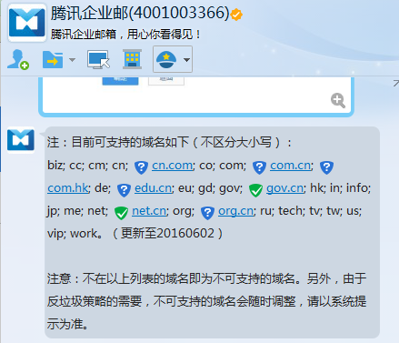

## 快速搭建专属域名邮箱

### 一、什么是域名邮箱

我们常用的通常是 `xxx@qq、xxx@163、xxx@126、xxx@gmail` 等结尾的邮箱地址，但是如果需要自定义一个属于自己域名的邮箱`（如：xxx@mydomain.com）`就需要自己动手搭建，**下面以使用腾讯企业邮箱进行搭建**；

> Tip： 搭建前需要拥有一个域名，如果没有可以在<a href=" https://wanwang.aliyun.com/ ">阿里云万网</a> 购买一个。（腾讯企业邮箱有域名后缀要求，否则可能会造成无法正常使用，尽量注册图下后缀的域名）

