#### 一、关于Redis

> Redis是什么：缓存式的分布式数据库、内存分布式数据库
>
> 其他产品：
>
> * 文档型数据库：
>   * MongoDB【基于分布式文件存储的数据库】；
> * 列存储数据库：
>   * Cassandra，HBase
>   * 分布式文件系统
> * 图关系数据库：
>   * 存放关系，比如：朋友圈社交网络、广告推荐系统，用于构建关系图谱（不是放图形的）
>   * Neo4J，InfoGrid
>


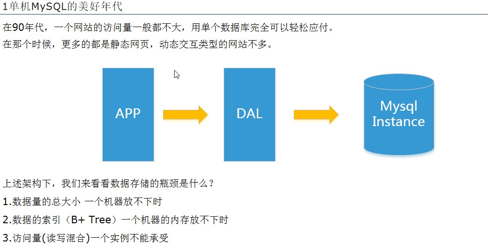

> --------------------------------------------------------------------------------------------------------------------------------------------

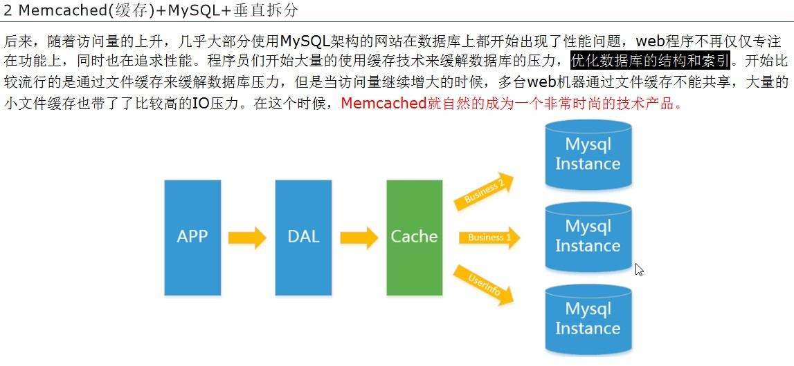

> --------------------------------------------------------------------------------------------------------------------------------------------

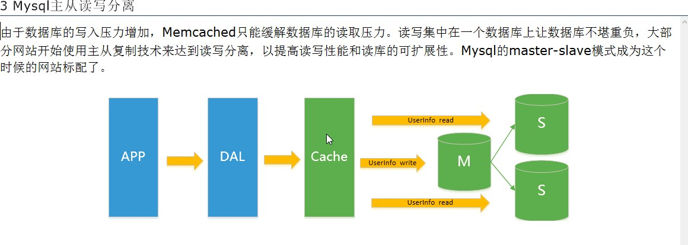

> --------------------------------------------------------------------------------------------------------------------------------------------

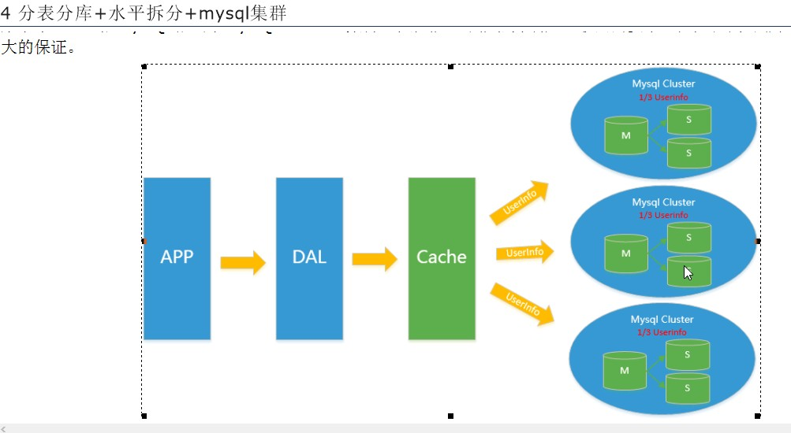


##### 1.1 开启redis服务

```
# 1. 根据指定配置文件启动redis服务
redis-server ./redis.conf
# 2. 进入交互模式
./redis-cli
```


##### 1.2 3V 和 3高

* 3V（大数据时代的3V）
  * 海量（Volume）
  * 多样（Variety）
  * 实时（Velocity）
* 3高（互联网需要的3高）
  * 高并发
  * 高可扩
  * 高性能


##### 1.3 什么是去IOE？

> 去除IBM小型机，Oracle数据库以及EMC存储设备；

##### 1.4 理解 CAP + BASE 和传统的ACID

* 传统的ACID：
  * A：原子性（Atomicity）
  * C：一致性（Consistency）
  * I：独立性（Isolation）
  * D：持久性（Durability）
* CAP：
  * C：强一致性（Consistency）
  * A：可用性（Availability）
  * P：分区容错性，通常必占（Partition tolerance）
  * 特点：最多只能满足两个，只能三选二，没有Nosql能保证三个同时满足
    * CA：单点集群，满足一致性，可用性的系统，通常在可扩展性上不太强大【传统的Oracle数据库】；
    * CP：满足一致性，分区容错性的系统，通常性能不是特别高【Readis、MongoDB】；
    * △AP：满足可用性，分区容忍性的系统，通常可能对一致性要求低一些【大多数网站架构的选择】；
* BASE：
  * 基本可用（Basically Available）
  * 软状态（Soft state）
  * 最终一致（Eventually consistent）
  * 特点：为了解决关系数据库强一致性引起的问题，而引起的可用性降低提出的解决方案；
    * 核心思想：让系统放松对某一时刻数据的一致性要求，换取系统整体伸缩性和性能上的改观；
* 分布式+集群简介：
  * 分布式：不同的多台服务器上面部署不同的服务模块（工程），他们之间通过Rpc/Rmi之间通信和调用，对外提供服务和组内协作；
  * 集群：不同的多台服务器上面部署相同的服务模块，通过分布式调度软件进行统一的调度，对外提供服务和访问；


CAP图解：

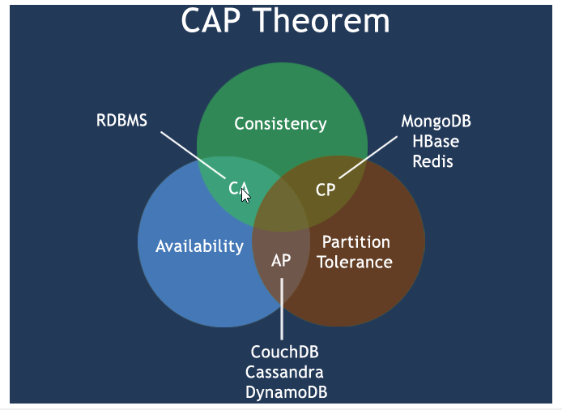


#### 二、在Centos安装readis

* 下载redis压缩包：
  * `wget http://download.redis.io/releases/redis-5.0.5.tar.gz`；
  * 解压到/opt目录：`tar -xzvf redis-5.0.5.tar.gz`
  
* 安装依赖软件：
  * 安装gcc：`yum install gcc`【gcc是linux下的一个编译程序，是C程序的编译工具】；
  * 安装tcl：`yum install tcl`；

* 运行初始化：

  * 执行以下命令，生成`redis-server & redis-cli`等启动redis服务的脚本

  * ```
    # 在redis安装目录执行
    make
    ```

* 参考文章： https://www.jianshu.com/p/aac0fb435bb0 


查看redis安装路径：

> ```
> # 1. 找到进程
> ps -ef|grep redis
> 
> # 2. 根据进程号找到路径
> ls -l /proc/进程号/cwd
> ```

修改redis.conf

```
# daemonize no
daemonize yes

# maxmemory <bytes> 
maxmemory 128MB 
```

进入交互模式：

```
# 找到redis-cli执行
/opt/src/redis-cli

# 成功显示
127.0.0.1:6379>
```


#### 三、redis基础知识

* 单进程
* 默认16个数据库
* Select命令切换数据库
* Dbsize查看当前数据库的key的数量
  * `keys *`：打印当前库所有键名；
  * `key k?`：查询所有以k开头的键名；
* Flushdb：清空当前库；
* Flushall：通杀全部库；
* 统一密码管理，16个库都是同样的密码；
* Redis索引是从0开始
* 默认端口6379


#### 四、redis的数据类型

* 键（Key）

  * keys * ：查看当前库所有的键；
  * exists key：判断某个key是否存在；
  * move key db：
  * expire key 秒数：为给定的key设置过期时间；
  * ttl key：查看还有多少秒过期，-1表示永不过期，-2表示已过期；
  * type key：查看你的key是什么类型；

* 字符串（String）
  * 二进制安全的，可以包含任何数据（如：图片或序列化的对象）；
  * 字符串value最多可以是512M；
  * 常用命令：
    * append key 要追加的字符串；
    * Incr/Decr：将key值递增1（`INCR key`）
    * Incrby(递增)/Decrby(递减)：将key值递增3（`INCRBY key 3`）；
    * getrange：获取指定区间范围内的值
      * 获取全部：`GETRANGE key 0 -1`
      * 获取区间：`GETRANGE key 0 2`
    * setrange：设置指定区间范围内的值
      * 在1的位置开始替换：`SETRANGE key 1 xxx`;
    * setex：设置一个key value并指定过期时间
      * 语法：setex key 秒 value
      * 示例：`setex k1 10 hello`
    * setnx：设置一个key value，如果当前key已存在则不创建
      * 语法：setnx key value
      * (integer) 0：该key已存在
    * mset/mget/msetnx：
      * mset：设置多个key value，语法：`mset k1 v1 k2 v2 k3 v3`；
      * mget：获取多个key的value，语法：`mget k1 k2 k3`
      * msetnx：设置多个key value【如果某个key已存在，则全部设置失败】
  
* 列表（List）
  
  * 元素可以重复，列表是简单的字符串列表，底层是链表；
  * 常用命令：
    * lpush：
      * 作用：创建列表，后进先出
      * 语法：`lpush list01 1 2 3 4 5`
      * 获取列表：`5 4 3 2 1`
    * rpush：
      * 作用：创建列表，先进先出
      * 语法：`rpush list02 1 2 3 4`
      * 获取列表：`1 2 3 4`
    * lrange：
      * 作用：获取列表
      * 语法：`lrange listName`
    * lpop：
      * 作用：获取/弹出列表第一个元素；
      * 语法：`lpop listName`
      * 特点：当获取完List的元素后，会清除掉当前的listName
    * rpop：
      * 作用：获取/弹出列表最后一个元素；
      * 语法：`rpop listName`
    * lrem：
      * 作用：删除列表中N个value值
      * 语法：`LREM listName N value`
    * ltrim：
      * 作用：截取列表指定范围的值后，再赋值给指定的列表；
      * 语法：`ltrim listName 0 3`
    * rpoplpush：
      * 作用：将源列表的最后一个元素，弹出到目标列表第一位；
      * 语法：`rpoplpush 源列表 目标列表`
    * lset：
      * 作用：设置/覆盖列表指定index的value
      * 语法：`lset listName index value`
  
* 集合（Set）
  * 存储string类型元素的集合；
  
  * 无序不重复，通过HashTable实现；
  
  * 常用命令：
  
    * ```
      # 创建Set集合
      sadd setList 1 2 3 4 5 6
      # 获取
      smembers setList
      # 删除集合中为6的元素
      srem setList 6
      # 在集合中随机抛出3个元素
      srandmember setList 3
      # 随机弹出2个元素出栈，如果只剩一个则弹1个
      spop setList 2
      # 将setList集合中移除元素1添加到目标setList02
      smove setList setList02 1
      # 删除集合
      del setList
      ```
  
  * 数学集合类：
  
    * ```
      # 差集 sdiff，获取setList01集合中setList02不存在的元素
      sdiff setList01 setList02
      # 交集 sinter
      
      # 并集 sunion
      ```
  
* △ 哈希（Hash）
  * 类似java中的Map，Key Value模式，但Value是一个键值对；
  
  * hash是一个string类型的field和value的映射表,适合存储bean对象；
  
  * 常用命令：
  
    * ```
      # hset/hget/hmset/hmget/hgetall/hdel
      # 1. 设置Hash - user:{id:1001}
      hset user id 1001
      # 2. 获取id值
      hget user id
      # hmset设置多个值
      
      # hmget 获取多个值
      
      # hgetall获取所有键值对
      
      # hdel删除键值对
      
      # hlen获取键值对数量
      
      # hexists 判断user中是否存在某个键值对
      
      # hkeys 获取所有key
      
      # hvals 获取所有value
      
      # hincrby 递增某个key的value(int)
      
      # hincrbyfloat 递增某个key的value(float)
      
      # hsetnx 判断指定值
      ```
  
      
  
* 有序集合Zset（sorted set）
  * 与Set相似，不同的是每个元素会关联一个double类型的分数；
  
  * redis正是通过分数来为集合中的成员进行从小到大排序；
  
  * Zset的成员是唯一的，但分数（score）却可以重复；
  
  * 与set的区别：
  
    * ```
      # set k1 v1 k2 v2
      
      # zset k1 score1 v1 k2 score2 v2
      ```
  
      
  
  * 常用命令：
  
    * ```
      # zadd 设置集合
      zadd levels 60 v1 70 v2 80 v3 90 v4 100 v5
      # zrange - 获取集合【withscores打印分数+value】
      zrange levels 0 -1
      zrange levels 0 -1 withscores
      
      # zrangebyscore 获取指定分数范围的值
      # "(" 表示不包含
      # limit start end：截取
      zrangebyscore levels 60 80
      
      # zrem 删除v5和100的分数
      zrem levels v5
      
      # zcount 获取指定分数区间的value
      zcount levels 60 80
      
      # zrank 获取下标
      zrank levels v3
      
      # zrevrange 逆序获取value
      ```
  
      
  
* nil：表示空/零；


#### 五、redis.conf配置文件

> LRU（ Least Recently Used ）： 即最近最少使用， 选择最近最久未使用的数据予以淘汰;

* Units单位

  * 对大小写不敏感

  * ```
      11 # 1k => 1000 bytes
      12 # 1kb => 1024 bytes
      13 # 1m => 1000000 bytes
      14 # 1mb => 1024*1024 bytes
      15 # 1g => 1000000000 bytes
      16 # 1gb => 1024*1024*1024 bytes
      17 #
      18 # units are case insensitive so 1GB 1Gb 1gB are all the same.
    ```

* INCLUDES包含

  * 可以引入/包含其他的redis配置文件【分割模块】

  * ```
      35 # include /path/to/local.conf
      36 # include /path/to/other.conf
    ```

* GENERAL通用

  * ```
     # 默认情况下，Redis不会作为守护程序运行。 如果需要，请使用“yes”。
     # 注意，Redis守护进程将在/var/run/redis.pid中写入一个pid文件。
     
     # 开启守护进程
     supervised yes
     
     pidfile /var/run/redis_6379.pid
     
     # redis数据库数量
     database 16
     
     # redis日志文件路径
     logfile ""
    ```

* NETWORK网络

  * ```
    # backlog是一个连接队列【队列总和=未完成三次握手队列+已完成三次握手队列】
    # 在高并发环境下需要一个高backlog值来避免慢客户端连接问题
    # 注意Linux内核会将这个值减小到/proc/sys/net/core/somaxconn
    # 所以需要确认增大somaxconn和tcp_max_syn_backlog两个值来达到想要的效果
    
    tcp-backlog 511
    
    # 客户端闲置N秒后关闭连接（0禁用,表示一直连着）
    timeout 0
    
    # 日志级别
    # This can be one of:
    # debug (a lot of information, useful for development/testing)
    # verbose (many rarely useful info, but not a mess like the debug level)
    # notice (moderately verbose, what you want in production probably)
    # warning (only very important / critical messages are logged)
    
    loglevel notice
    
    # 日志输出文件
    logfile /var/log/redis/redis.log
    
    # 单位为秒，如果设置为0，则不会进行keepalive检测
    # 表示间隔300秒检测一次是否保持连接状态
    tcp-keepalive 300
    
    
    # 是否把日志输出到syslog中
    # syslog-enabled no
    
    # 指定syslog系统里的日志标识（默认redis）
    # syslog-ident redis
    
    # 指定syslog设备，值可以是USER 或LOCAL0-LOCAL7.
    # syslog-facility local0
    ```

    

* SNAPSHOTTING快照

  * ```
    # 指定本地数据库存放目录
    # 在redis 交互命令中使用 config get dir显示的目录
    dir /var/lib/redis
    
    # 触发redis更新备份文件条件
    # 如果想禁用RDB持久化策略，只要不设置任何save指令或save=""即可
    
    # 1.900秒触发1次操作
    save 900 1
    # 2.300秒触发10次操作
    save 300 10
    # 3. 60秒触发10000次操作
    save 60 10000
    
    # redis数据库备份文件
    dbfilename dump.rdb
    
    # 如果设置为no，表示不在乎数据不一致或有其他的手段发现和控制
    stop-writes-on-bgsave-error yes
    
    # 对于存储到磁盘中的快照，可以设置是否进行压缩存储【通常开启】
    # yes：会采用LZF算法进行压缩
    # no：不进行压缩，节省CPU
    rdbcompression yes
    
    
    # 在存储快照后，还可以让redis使用CRC64算法来进行数据校验
    # 但是这样做会增加大约10%的性能消耗【通常开启】
    rdbchecksum yes
    ```

  * save & bgsave保存快照：

    * save：只管保存，其它不管，全部阻塞；
    * bgsave：Redis会在后台异步进行快照操作，快照同时还可以响应客户端请求。可以通过lastsave命令获取最后一次成功执行快照的时间；

  * 如何恢复redis数据：

    * 将备份文件`dump.rdb`文件移动到redis安装目录并启动服务即可；
    * config get dir获取安装目录；

* REPLICATION复制

* SECURITY安全

  * ```
    # 设置redis 校验密码
    config set requirepass "123456"
    
    # 校验密码
    auth 123456
    ```

* LIMITS限制

  * Maxclients

  * Maxmemory：配置最大缓存；

  * Maxmemory-policy（缓存清除策略）

    * 当达到一定最大缓存的时候，会执行以下配置的指定策略进行缓存的清除；

      ```
      # 使用LRU算法移除key，只对设置了过期时间的键
      # volatile-lru -> remove the key with an expire set using an LRU algorithm
      
      # 使用LRU算法移除key
      # allkeys-lru -> remove any key according to the LRU algorithm
      
      # 在过期集合中移除随机的key，只对设置了过期时间的键
      # volatile-random -> remove a random key with an expire set
      
      # 移除随机的key
      # allkeys-random -> remove a random key, any key
      
      # 移除那些TTL值最小的key，即那些最近要过期的key
      # volatile-ttl -> remove the key with the nearest expire time (minor TTL)
      
      # 不进行移除，针对写操作：知识返回错误信息
      # noeviction -> don't expire at all, just return an error on write operations
      ```

  * Maxmemory-samples：

    * 设置样本数量，LRU算法和最小TTL算法都并非是精确的算法，而是估算值。所以你可以设置样本的大小，redis默认会检查这么多个key并选择其中LRU的那个；

* APPEND ONLY MODE追加

  * ```
    # 开启AOF持久化模式
    appendonly yes
    
    # AOF持久化备份的文件
    appendfilename "appendonly.aof"
    
    # always：同步持久化。每次发生数据变更会被立即记录到磁盘（性能差但数据完整性较好）
    # everysec：出厂默认推荐。异步操作、每秒记录（如果一秒内宕机，有数据丢失）
    # no
    appendfsync everysec
    
    # 重写时是否可以运用appendfsync（用默认no即可，保证数据安全性）
    no-appendfsync-on-rewrite no
    
    # 设置重写的基准值(表示100%，1倍)
    auto-aof-rewrite-percentage 100
    # 设置重写的基准值（当AOF文件大小是上次rewrite后大小的一倍且文件大于64M时触发）
    # 通常大的网站3gb起步
    auto-aof-rewrite-min-size 64mb
    ```

##### 常见配置总结

```
1. Redis默认不是以守护进程的方式运行，可以通过该配置项修改，使用yes启用守护进程

  daemonize no

2. 当Redis以守护进程方式运行时，Redis默认会把pid写入/var/run/redis.pid文件，可以通过pidfile指定

  pidfile /var/run/redis.pid

3. 指定Redis监听端口，默认端口为6379，作者在自己的一篇博文中解释了为什么选用6379作为默认端口，因为6379在手机按键上MERZ对应的号码，而MERZ取自意大利歌女Alessia Merz的名字

  port 6379

4. 绑定的主机地址

  bind 127.0.0.1

5.当 客户端闲置多长时间后关闭连接，如果指定为0，表示关闭该功能

  timeout 300

6. 指定日志记录级别，Redis总共支持四个级别：debug、verbose、notice、warning，默认为verbose

  loglevel verbose

7. 日志记录方式，默认为标准输出，如果配置Redis为守护进程方式运行，而这里又配置为日志记录方式为标准输出，则日志将会发送给/dev/null

  logfile stdout

8. 设置数据库的数量，默认数据库为0，可以使用SELECT <dbid>命令在连接上指定数据库id

  databases 16

9. 指定在多长时间内，有多少次更新操作，就将数据同步到数据文件，可以多个条件配合

  save <seconds> <changes>

  Redis默认配置文件中提供了三个条件：

  save 900 1

  save 300 10

  save 60 10000

  分别表示900秒（15分钟）内有1个更改，300秒（5分钟）内有10个更改以及60秒内有10000个更改。

 

10. 指定存储至本地数据库时是否压缩数据，默认为yes，Redis采用LZF压缩，如果为了节省CPU时间，可以关闭该选项，但会导致数据库文件变的巨大

  rdbcompression yes

11. 指定本地数据库文件名，默认值为dump.rdb

  dbfilename dump.rdb

12. 指定本地数据库存放目录

  dir ./

13. 设置当本机为slav服务时，设置master服务的IP地址及端口，在Redis启动时，它会自动从master进行数据同步

  slaveof <masterip> <masterport>

14. 当master服务设置了密码保护时，slav服务连接master的密码

  masterauth <master-password>

15. 设置Redis连接密码，如果配置了连接密码，客户端在连接Redis时需要通过AUTH <password>命令提供密码，默认关闭

  requirepass foobared

16. 设置同一时间最大客户端连接数，默认无限制，Redis可以同时打开的客户端连接数为Redis进程可以打开的最大文件描述符数，如果设置 maxclients 0，表示不作限制。当客户端连接数到达限制时，Redis会关闭新的连接并向客户端返回max number of clients reached错误信息

  maxclients 128

17. 指定Redis最大内存限制，Redis在启动时会把数据加载到内存中，达到最大内存后，Redis会先尝试清除已到期或即将到期的Key，当此方法处理 后，仍然到达最大内存设置，将无法再进行写入操作，但仍然可以进行读取操作。Redis新的vm机制，会把Key存放内存，Value会存放在swap区

  maxmemory <bytes>

18. 指定是否在每次更新操作后进行日志记录，Redis在默认情况下是异步的把数据写入磁盘，如果不开启，可能会在断电时导致一段时间内的数据丢失。因为 redis本身同步数据文件是按上面save条件来同步的，所以有的数据会在一段时间内只存在于内存中。默认为no

  appendonly no

19. 指定更新日志文件名，默认为appendonly.aof

   appendfilename appendonly.aof

20. 指定更新日志条件，共有3个可选值： 

  no：表示等操作系统进行数据缓存同步到磁盘（快） 

  always：表示每次更新操作后手动调用fsync()将数据写到磁盘（慢，安全） 

  everysec：表示每秒同步一次（折衷，默认值）

  appendfsync everysec

 

21. 指定是否启用虚拟内存机制，默认值为no，简单的介绍一下，VM机制将数据分页存放，由Redis将访问量较少的页即冷数据swap到磁盘上，访问多的页面由磁盘自动换出到内存中（在后面的文章我会仔细分析Redis的VM机制）

   vm-enabled no

22. 虚拟内存文件路径，默认值为/tmp/redis.swap，不可多个Redis实例共享

   vm-swap-file /tmp/redis.swap

23. 将所有大于vm-max-memory的数据存入虚拟内存,无论vm-max-memory设置多小,所有索引数据都是内存存储的(Redis的索引数据 就是keys),也就是说,当vm-max-memory设置为0的时候,其实是所有value都存在于磁盘。默认值为0

   vm-max-memory 0

24. Redis swap文件分成了很多的page，一个对象可以保存在多个page上面，但一个page上不能被多个对象共享，vm-page-size是要根据存储的 数据大小来设定的，作者建议如果存储很多小对象，page大小最好设置为32或者64bytes；如果存储很大大对象，则可以使用更大的page，如果不 确定，就使用默认值

   vm-page-size 32

25. 设置swap文件中的page数量，由于页表（一种表示页面空闲或使用的bitmap）是在放在内存中的，，在磁盘上每8个pages将消耗1byte的内存。

   vm-pages 134217728

26. 设置访问swap文件的线程数,最好不要超过机器的核数,如果设置为0,那么所有对swap文件的操作都是串行的，可能会造成比较长时间的延迟。默认值为4

   vm-max-threads 4

27. 设置在向客户端应答时，是否把较小的包合并为一个包发送，默认为开启

  glueoutputbuf yes

28. 指定在超过一定的数量或者最大的元素超过某一临界值时，采用一种特殊的哈希算法

  hash-max-zipmap-entries 64

  hash-max-zipmap-value 512

29. 指定是否激活重置哈希，默认为开启（后面在介绍Redis的哈希算法时具体介绍）

  activerehashing yes

30. 指定包含其它的配置文件，可以在同一主机上多个Redis实例之间使用同一份配置文件，而同时各个实例又拥有自己的特定配置文件

  include /path/to/local.conf
```


#### 六、redis持久化

##### 6.1 RDB（Redis DataBase）

> 概述：`在指定的时间间隔内`，将内存中的数据集快照写入磁盘`（也就是行话讲的Snapshot快照）`，它恢复时将快照文件直接读到内存里；


* Redis会单独创建（fork）一个子进程来进行持久化，会先将数据写入到一个临时文件中，待持久化过程都结束了，再用这个临时文件替换上次持久化好的文件；
* 整个过程中，主进程是不进行任何IO操作的，从而确保极高的性能。如果需要进行大规模数据的恢复，且`对于数据恢复的完整性不是非常敏感`，那么RDB方式要比AOF方式更加的高效；
* RDB的缺点是最后一次持久化后的数据可能丢失；
* Fork：作用是复制一个与当前进程一样的子进程，子进程的所有数据（变量、环境变量、程序计数器等）数值都和原进程一致。
* RDB保存的是dump.rdb文件【通常运维会通过shell脚本，定期的备份到另外一台服务器上】；
* 手动调用立即备份最新redis数据到dump.rdb文件：
  * 执行`save`命令
* 优点：
  * 适合大规模的数据恢复
  * 对数据完整性和一致性要求不高
* 缺点：
  * 在一定间隔时间做一次备份，如果redis意外down掉，就会丢失最后一次快照后的所有修改；
  * Fork的时候，内存中的数据被克隆了一份，大致2倍的膨胀性需要考虑；

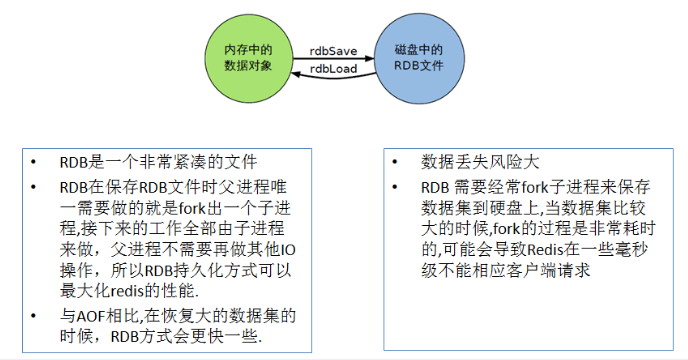

##### 6.2 AOF（Append Only File）

> 概述：`以日志的形式,每秒记录一次每个写操作`，将Redis执行过的所有写指令记录下来（读操作不记录），只需追加文件但不可以改写文件；redis启动之初会读取该文件`("appendonly.aof")`重新构建数据；
>
> * AOF 保存的是appendonly.aof文件；
> * 优点：
>   * 每秒同步 - appendfsync always
>   * 每修改同步 - appendfsync everysec
>   * 不同步 - appendfsync no
> * 缺点：
>   * 频繁的IO；
>   * 相同数据集的数据而言，AOF文件要远大于RDB文件，恢复速度慢于RDB；
>   * AOF运行效率要慢于RDB，每秒同步策略效率较好，不同步效率和RDB相同；


###### △ Rewrite（重写）

> * 是什么：
>   * AOF采用文件追加方式，文件会越来越大。为避免出现这种情况，新增了`重写机制`，当AOF文件的大小超过所设定的阈值时，Redis就会启动AOF文件的内容压缩，只保留可以恢复数据的最小指令集，`可以使用命令bgrewriteaof`
> * 重写原理：
>   * AOF文件持续增长而过大时，会fork出一条新进程来将文件重写（也是先写临时文件最后再rename），遍历新进程内存中的数据，每条记录有一条Set语句。
>   * 重写AOF文件的操作，并没有读取旧的AOF文件，而是将整个内存中的数据库内容用命令的方式重写了一个新的AOF文件，这点和快照有点类似；
> * 触发机制：
>   * Redis会记录上次重写时的AOF文件大小，默认配置是`当AOF文件大小是上次rewrite后大小的一倍且文件大于64M时触发`；

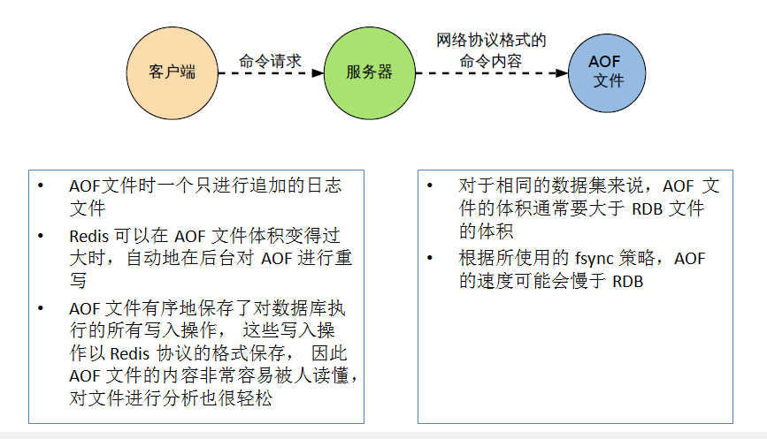

##### 6.3 RDB 和 AOF总结

* RDB和AOF的区别：
  * RDB
    * 通过`dump.rdb`备份文件进行恢复，特点是每间隔一段时间达到指定的操作数量则会更新备份文件；
  * AOF
    * 通过`appendonly.aof`文件记录redis的的每个写操作，在下一次启动redis时读取该文件记录的redis写操作命令重新构建数据；
* RDB和AOF文件同时存在时，优先读取`appendonly.aof`文件的数据；
* 修复RDB和AOF文件
  * `redis-check-aof --fix appendonly.aof`
  * `redis-check-dump --fix dump.rdb`
* 只做缓存：
  * 如果只希望数据在服务器运行的时候存在，可以不适用任何的持久化方式；
* 同时开启RDB&AOF持久化方式：
  * 当redis重启的时候会优先载入AOF文件来恢复原始的数据；
  * 通常情况下AOF文件保存的数据集要比RDB文件保存的数据要完整；


#### 七、事务

> 概述：一次执行多个命令，本质是一组命令的集合。一个事务中的所有命令都会序列化，`按顺序的串行化执行，而不会被其他命令插入【如：积攒5个redis命令后一起执行】`；
>
> redis是否支持事务：部分支持。


##### 7.1 事务命令

| 命令               | 描述                                                         |
| ------------------ | ------------------------------------------------------------ |
| DISCARD            | 放弃执行事务块内的所有命令（取消事务）                       |
| EXEC               | 执行所有事务块内的命令（执行事务）                           |
| MULTI              | 标记一个事务块的开始（开启事务）                             |
| UNWATCH            | 取消WATCH命令对所有key的监视                                 |
| WATCH key [key...] | 监视一个或多个key，如果在事务执行之前这些key被其他命令所改动，那么事务将被打断 |


##### 7.2 常用命令

> 当开启事务时，每一条redis命令都会添加到事务队列中；

* 正常执行：
  * 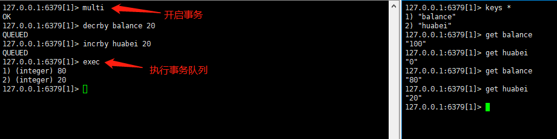
* 放弃事务：
  * 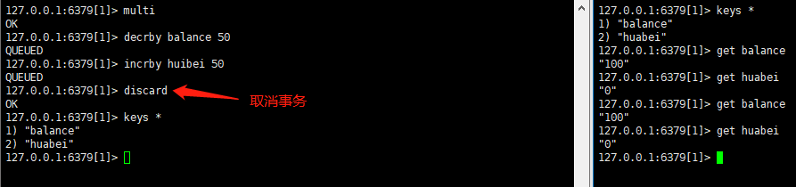
* 可回滚的部分事务：
  * 事务队列中某一条redis命令报错，则其他命令全部失败`(如：一些严重的redis语法错误)`；
* 不可回滚的部分事务：
  * 某些事务队列中的命令报错，在EXEC运行时才知道的错误，不会回滚事务，并且会提交除了失败之外的其他操作。
* watch监控：
  * 悲观锁 & 乐观锁 & CAS（Check And Set）
    * 悲观锁：
      * 每次拿数据的时候都认为被人会修改，所以每次在拿数据的时候都会上锁，这样别人想拿这个数据就会block直到它拿到锁。
      * 传统的关系型数据库里边就用到了很多这种锁机制。（比如：行锁、表锁、读锁、写锁等，都是在做操作之前先锁上）
    * 乐观锁：
      * 每次去拿数据的时候都认为别人不会修改，所以不会上锁，但是在更新的时候会判断一下在此期间别人有没有去更新这个数据。可以`使用版本号`等机制。（乐观锁适用于多读的应用类型，这样可以提高吞吐量）
      * 乐观锁策略：提交版本必须大于记录当前版本才能执行更新
    * CAS
  * 初始化信用卡可用余额和欠额
  * 无加塞篡改，先监控再开启multi，保证两笔金额变动在同一个事务内
  * 有加塞篡改
  * unwatch
  * 一旦执行了exec之前加的监控锁都会被取消掉
  * 小结：
    * Watch指令类似乐观锁，事务提交时，如果Key的值已被别的客户端改变（比如：某个list已被别的客户端push/pop过），整个事务队列都不会被执行；
    * 通过Watch命令在事务执行之前监控了多个keys，`倘若在Watch 之后有任何key的值发生了变化，EXEC命令执行的事务都将被放弃`，同时返回Nullmulti-bulk应答，以通知调用者事务执行失败；

##### 7.3 执行阶段

> * 开启：以MULTI命令开启一个事务；
> * 入队：将多个命令加入到事务队列中，接到这些命令并不会立即执行，而是放到等待执行的事务队列里面；
> * 执行：使用EXEC命令触发事务，执行事务队列里的所有命令；

##### 7.4 特性

> * 单独的隔离操作：
>   * 事务中的所有命令都会序列化、按顺序的执行
> * 没有隔离级别的概念：
>   * 队列中的命令没有提交之前都不会实际的被执行；
> * 不保证原子性：
>   * 部分支持事务。（如：某些只有在执行时才出现的错误/异常）
>   * redis同一个事务中如果有一条命令执行失败，其后的命令仍然会被执行，没有回滚；


#### 八、主从复制（读写分离）

> 概述：主机数据更新后根据配置和策略，自动同步到备机的机制【主master/从slaver复制】；
>
> 特点：
>
> * Master以写为主，Slave以读为主 
> * 配从库不配主库


##### 8.1 修改配置文件操作

1. 拷贝多个redis.conf文件

2. 开启daemonize yes

3. Pid文件名字

4. 指定端口

5. Log文件名字

6. dump.rdb名字

##### 8.2 常用的配置方式

###### 一主二从

> 特点：所有的从服务器连接的都是相同的一个主服务器地址

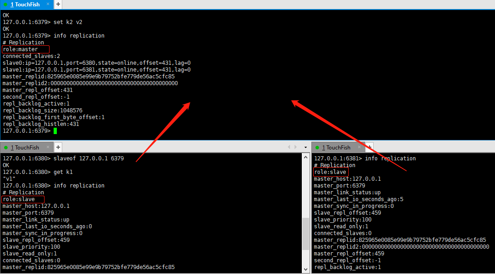


redis交互命令

```
# 查看当前redis主从关系信息
info replication


# 设置当前redis为从服务器
# 127.0.0.1:6379为主服务器
SLAVEOF 127.0.0.1 6379
```

<font color="red">当SLAVEOF设置从服务器时，会读取主服务器所有的数据保存到从服务器</font>

###### 薪火相传

> 特点：上一个服务器作为下一个服务器的主机；

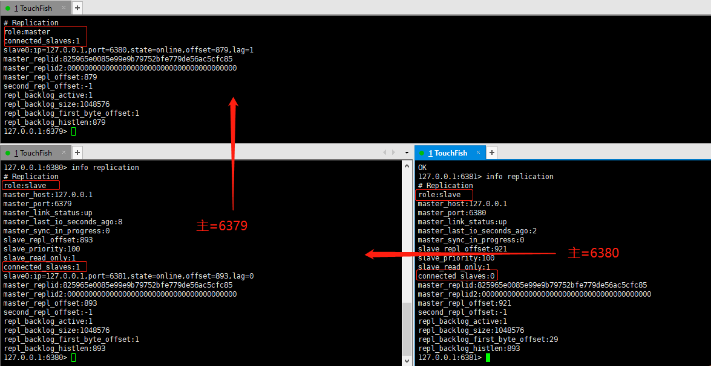

###### 哨兵模式（sentinel）

> 概述： 哨兵模式是一种**高可用集群模式**，首先Redis提供了哨兵的命令，哨兵是一个独立的进程，作为进程，它会独立运行。其原理是**哨兵通过发送命令，等待Redis服务器响应，从而监控运行的多个Redis实例（Sentinel无法保证强一致性）** ；
>
> 哨兵模式原理文章： https://juejin.im/post/6844903663362637832#heading-6 


**单哨模式**

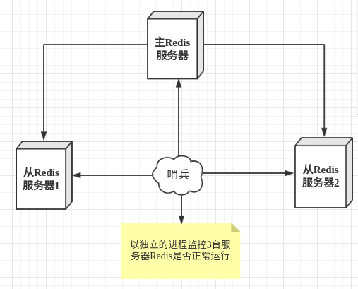

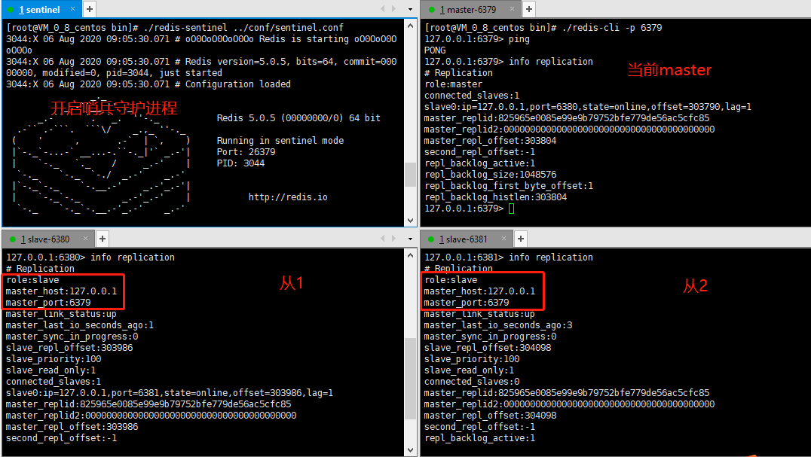


**一主二从三哨模式**

>通常至少会创建三个sentinel(三个哨兵)实例，并且保证这些实例放到不同的实例上，甚至不同的物理区域（即不同的服务器）；

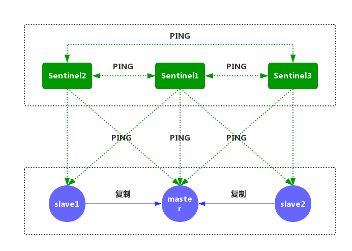


**sentinel.conf配置文件**

```
# 故障转移的超时时间failover-timeout，默认三分钟
sentinel failover-timeout mymaster 180000

# 指定了在发生failover主备切换时，最多可以有多少个slave同时对新的master进行同步。
# 这个数字越小，完成failover所需的时间就越长；反之，但是如果这个数字越大，
# 就意味着越多的slave因为replication而不可用。可以通过将这个值设为1，
# 来保证每次只有一个slave，处于不能处理命令请求的状态。
# sentinel parallel-syncs <master-name> <numslaves>
sentinel parallel-syncs mymaster 1 


# 指定主节点应答哨兵sentinel的最大时间间隔，超过这个时间，哨兵主观上认为主节点下线，默认30秒  
# sentinel down-after-milliseconds <master-name> <milliseconds>
sentinel down-after-milliseconds mymaster 30000  

# 当在Redis实例中开启了requirepass <foobared>，所有连接Redis实例的客户端都要提供密码。
# sentinel auth-pass <master-name> <password>  
sentinel auth-pass mymaster 123456  

# 哨兵sentinel监控的redis主节点的 
# ip：主机ip地址
# port：哨兵端口号
# master-name：可以自己命名的主节点名字（只能由字母A-z、数字0-9 、这三个字符".-_"组成。）
# quorum：当这些quorum个数sentinel哨兵认为master主节点失联 那么这时 客观上认为主节点失联了  
# sentinel monitor <master-name> <ip> <redis-port> <quorum>  
sentinel monitor mymaster 127.0.0.1 6379 2
```


##### 8.3 **问题总结**

* <font color="red">主 & 从服务器同时执行`set k1 v1`命令</font>
  * 从服务器报错【从服务器只能执行读取操作】；
* <font color="red">当主服务器`Shutdown`关机后，从服务器会发生什么变化？</font>
  * 原地等待主服务器开启；
  * Replication信息状态：`master_link_status:down`；
* <font color="red">当从服务器`shutdown`断开，重新连接后它的role是master还是slave？</font>
  * master。默认重新连接都是master，除非修改redis.conf配置文件；
  * 重新运行`SLAVEOF`命令，配置主服务器地址，并读取数据；

##### 8.4 主从复制原理

1. Slave启动成功连接到master后会发送一个sync命令；

2. Master接到命令启动后台的存盘进程，同时收集所有接收到的用于修改数据集命令。在后台进程执行完毕之后，master将传送整个数据文件到slave，以完成一次完全同步；
3. 全量复制：而slave服务在接收到数据库文件数据后，将其存盘并加载到内存中；
4. 增量复制：Master继续将新的所有收集到的修改命令依次传给slave，完全同步；
5. 但是只要是重新连接master，一次完全同步（全量复制）将被自动执行；


#### 九、Jedis

> 概述：在Java中使用Jedis操作Redis服务；


##### 9.1 常用API


##### 9.2 事务


watch描述：

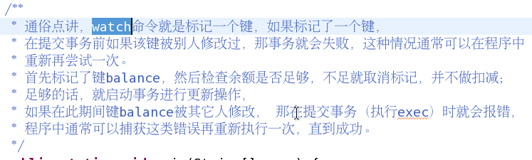

##### 9.3 主从复制


##### 9.4 Jedis Pool


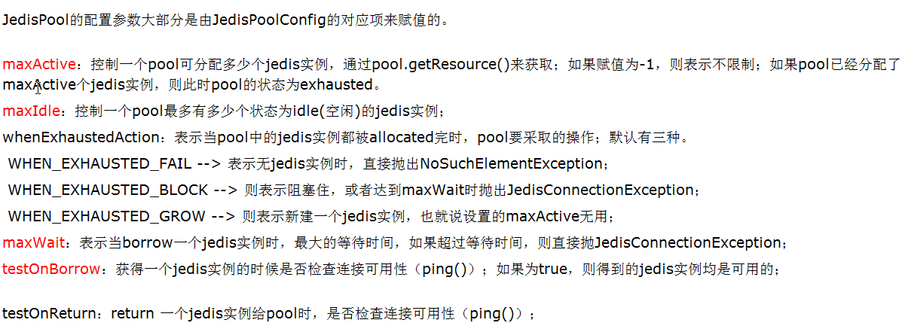

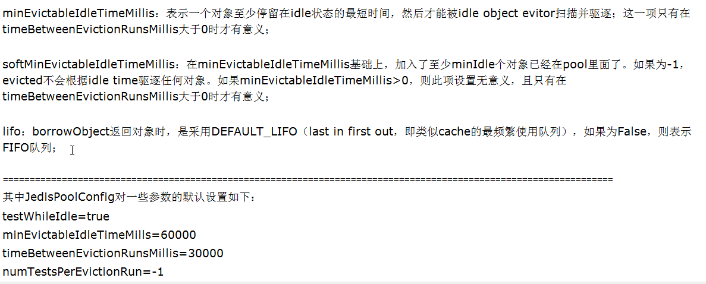


##### 9.5 连接远程Redis服务器

① 修改redis.conf配置

```
# 注释掉bind 127.0.0.1可以使所有的ip访问redis
# 若是想指定多个ip访问，但并不是全部的ip访问，可以bind
#bind 127.0.0.1

# 关闭保护模式 
protected-mode no
```

② 设置redis登录密码

```
# 在服务器中进入redis交互模式
redis-cli -p 6379

# 设置登录密码
config set requirepass "123456"

# 使用redis前校验密码
auth "123456"
```


③ 设置云服务器防火墙 和 安全组开放端口

> 注意：如果不配置会导致本地代码无法正常连接云服务器中的Redis服务


开发防火墙端口

```
# 查看防火墙tcp端口列表
firewall-cmd --list-all

# 配置防火墙开放端口
firewall-cmd --add-port=6379/tcp --permanent

# 重启防火墙，使端口生效
systemctl restart firewalld.service
```


<font color="red">安全组在放通Web服务端口中添加6379端口即可</font>


④ 使用Jedis测试连接远程Redis服务

>  在本地Java代码中，通过Jedis测试连接；
>
> 打印<font color="red">PONG</font>表示连接成功

```java
public class TestJedis {
    public static void main(String[] args) {
        Jedis jedis = new Jedis("106.53.88.***", 6379);
        jedis.auth("123456");
        System.out.println(jedis.ping());
    }
}
```


#### 十、拓展

##### 10.1 Redis被pnscan病毒挟持挖矿

<font color="red">由于公网上的Redis没有设置requirepass密码认证，并且端口是默认的6379</font>

`top -d 5`监控Linux服务器资源使用情况

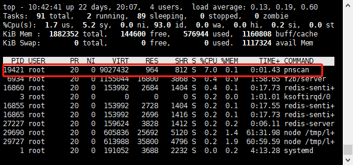

###### **清除病毒**

找到这个脚本存放目录，并且干掉

```
# 找到再 /usr/local/bin目录下
find / -name pnscan 

# 删除
rm -f /usr/local/bin/pnscan
```

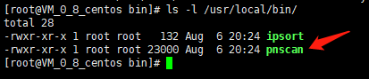


查看/etc目录下其他的恶意脚本

> 根据情况判断是否是恶意脚本
>
> 我的是经过对比另外一台正常的服务器etc目录，找到如下几个恶意文件
>
> phpupdate
>
> config.json
>
> networkmanager
>
> newdat.sh
>
> phpupdates

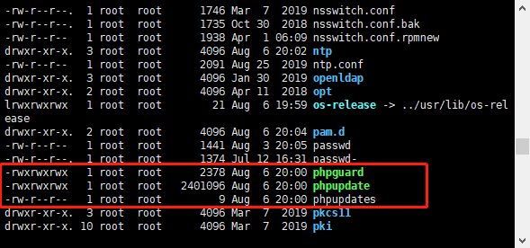

<font color="red">使用rm删除的时候，无法删除（Operation not permitted）</font>

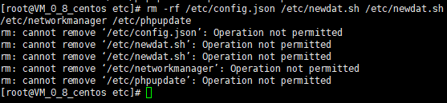

使用`lsattr filename `查看文件属性

```
# i：不得任意更动文件或目录。
----i--------e-- ./phpupdate
```

使用`chatter`命令改变文件属性，然后再次执行`rm`删除

```
chatter -i filename
```

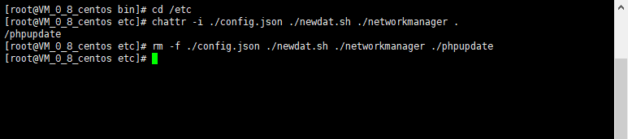


finish...


###### **防护措施**

在线上服务器中，redis的默认端口建议不要使用默认端口6379。并且添加Auth权限校验；

```
1、根据redis提供服务的需求，如果不需要外网访问，则修改设置 0.0.0.0:6379。只是本机访问则改为127.0.0.1:6379，如要其他内网机器访问，则设置为本地内网的IP，比如192.168.1.122:6379。

2、设置redis访问口令，命令如下：requirepass 密码串。建议设置密码要强悍，不要设置成 弱口令，因为redis允许长时间扫描，设置密码字符串长点，最好14位以上，记不住没有关系，因为密码在配置文件redis.conf中是明文保存的可随时查看。 比如requirepass 1qaz2wsx1234567890redis-=!@#ABC

3、如有必要，对redis的访问端口进行修改。

4、如有必要，利用防火墙对redis的访问IP进行限制。

5、如无必要，不要以root权限运行redis。Windows系统下不要以system权限运行。
```


>  参考文章： https://blog.csdn.net/yudian1991/article/details/104866105 


##### 10.2 redis的写丢失

client向一个master发送一个写请求，master写成功并通知client。在同步到slave之前，这个master挂了，它的slave代替它成为了新的master。这时前面写入的数据就丢失了。 


##### 10.3 Linux批量kill redis进程

```
# 1. 找到所有redis的进程id
ps -ef | grep redis | awk '{print $2}'

# 2. 使用xargs kill所有进程
ps -ef | grep redis | awk '{print $2}' | xargs kill -9
```

