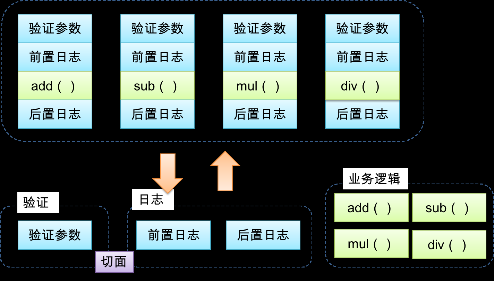
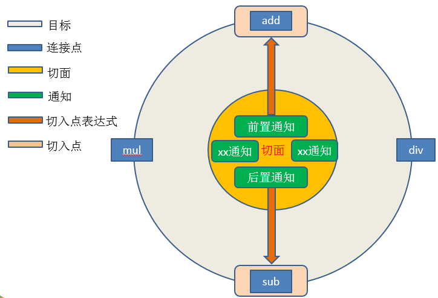
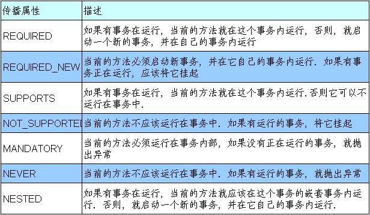

#### 一、概述

> Spring是一个IOC （DI）& AOP容器框架
>
> 
>
> 特点：
>
> * 非侵入式：基于Spring开发的应用中的对象可以不依赖于Spring的API（即：使用某个功能，必须先实现某个接口的抽象方法，称作：侵入式）；
> * 依赖注入：DI——Dependency Injection，`反转控制(IOC)`最经典的实现。
> * 面向切面编程：Aspect Oriented Programming——AOP
> * 容器：Spring是一个容器，因为它包含并且管理应用对象的生命周期
> * 组件化：Spring实现了使用简单的组件配置组合成一个复杂的应用。在 Spring 中可以使用XML和Java注解组合这些对象。
> * 一站式：在IOC和AOP的基础上可以整合各种企业应用的开源框架和优秀的第三方类库（实际上Spring 自身也提供了表述层的SpringMVC和持久层的Spring JDBC。


##### 1.1 IOC（Inversion of Control）反转控制

在应用程序中的组件需要获取资源时，传统的方式是组件主动的从容器中获取所需要的资源，在这样的模式下开发人员往往需要知道在具体容器中特定资源的获取方式，增加了学习成本，同时降低了开发效率。

反转控制的思想完全颠覆了应用程序组件获取资源的传统方式：反转了资源的获取方向——改由容器主动的将资源推送给需要的组件，开发人员不需要知道容器是如何创建资源对象的，只需要提供接收资源的方式即可，极大的降低了学习成本，提高了开发的效率。这种行为也称为查找的被动形式。

##### 1.2 DI（Dependency Injection） 依赖注入

IOC的另一种表述方式：即组件以一些预先定义好的方式(例如：setter 方法)接受来自于容器的资源注入。相对于IOC而言，这种表述更直接。

IOC 描述的是一种思想，而DI 是对IOC思想的具体实现. 


##### 1.3 IOC容器在Spring中的实现

* 1）在通过IOC容器读取Bean的实例之前，需要先将IOC容器本身实例化。

* Spring提供了IOC容器的两种实现方式
  * ① BeanFactory：IOC容器的基本实现，是Spring内部的基础设施，是面向Spring本身的，不是提供给开发人员使用的。
  * ② ApplicationContext：BeanFactory的子接口，提供了更多高级特性。面向Spring的使用者，几乎所有场合都使用ApplicationContext而不是底层的BeanFactory。

##### 1.4 ApplicationContext的主要实现类

* 1) ClassPathXmlApplicationContext：对应类路径下的XML格式的配置文件

* 2) FileSystemXmlApplicationContext：对应文件系统中的XML格式的配置文件

* 3) 在初始化时就创建单例的bean，也可以通过配置的方式指定创建的Bean是多实例的。

##### 1.5 ConfigurableApplicationContext

* 1) 是ApplicationContext的子接口，包含一些扩展方法

* 2) refresh()和close()让ApplicationContext具有启动、关闭和刷新上下文的能力。

##### 1.6 WebApplicationContext

专门为WEB应用而准备的，它允许从相对于WEB根目录的路径中完成初始化工作

##### 1.7 结构图（从下往上看）


* Core Container：核心容器
* AOP：面向切面编程
* Data Access
* Web


#### 二、HelloWorld

> 快速开发一个Spring HelloWorld程序


* 第一步：搭建Spring运行环境

  * 导入jar包

    ```
    # 1. 导入Spring自身核心JAR包：
    spring-beans-4.0.0.RELEASE.jar
    spring-context-4.0.0.RELEASE.jar
    spring-core-4.0.0.RELEASE.jar
    spring-expression-4.0.0.RELEASE.jar
    
    # 2. 导入core依赖包 
    commons-logging-1.1.1.jar
    ```

  * 创建 Spring Config 配置文件`applicationContext.xml`

  ```xml
  <?xml version="1.0" encoding="UTF-8"?>
  <beans xmlns="http://www.springframework.org/schema/beans"
         xmlns:xsi="http://www.w3.org/2001/XMLSchema-instance"
         xsi:schemaLocation="http://www.springframework.org/schema/beans http://www.springframework.org/schema/beans/spring-beans.xsd">
      <!--   
  		IOC容器 
  		创建相同类不同id的bean
  	-->
      <bean id="person" class="com.beans.Person">
          <property name="name" value="JosenLi"></property>
      </bean>
  
      <bean id="person2" class="com.beans.Person">
          <property name="name" value="Rose"></property>
      </bean>
  </beans>
  ```

* 第二步：创建Bean类 - Person 

  ```java
  package com.beans;
  /**
   * @ClassName Person
   */
  public class Person {
      private String name;
      public Person() {
      }
      public Person(String name) {
          this.name = name;
      }
      @Override
      public String toString() {
          return "Person{" +
                  "name='" + name + '\'' +
                  '}';
      }
      public String getName() {
          return name;
      }
  
      public void setName(String name) {
          this.name = name;
      }
  }
  ```
  
* 第三步：加载IOC容器，获取bean实例对象的三种方式

  ```java
      @Test
      public void testGetIOCBean(){
          // 加载IOC容器
          ClassPathXmlApplicationContext context = new ClassPathXmlApplicationContext("applicationContext.xml");
          // 使用IOC容器，获取xml配置好的bean对象
          // 方式一：需要强转
          Person person = (Person)context.getBean("person");
          System.out.println(person);
  
          // 方式二：如果出现多个兼容类型的bean，会出现错误
          // expected single matching bean but found 2: person,person2
  //        Person p2 = context.getBean(Person.class);
  //        System.out.println(p2);
          // 方式三：常用方式
          Person p3 = context.getBean("person2", Person.class);
          Person p4 = context.getBean("person", Person.class);
          System.out.println(p3);
          System.out.println(p4);
      }
  ```

* 总结：

  * 当调用`new ClassPathXmlApplicationContext("applicationContext.xml")`加载IOC容器的时候，默认会创建xml下所有的bean实例；


#### 三、IOC容器和Bean配置

##### 3.1 DI依赖注入的三种赋值方式

```xml
<?xml version="1.0" encoding="UTF-8"?>
<beans xmlns="http://www.springframework.org/schema/beans"
       xmlns:xsi="http://www.w3.org/2001/XMLSchema-instance"
       xsi:schemaLocation="http://www.springframework.org/schema/beans http://www.springframework.org/schema/beans/spring-beans.xsd">
    <!--  DI依赖注入  -->
    <!-- 方式一：
				通过bean的setXxx()方法赋值   
	-->
    <bean id="setCar" class="com.beans.Car">
        <property name="brand" value="奥迪"></property>
        <property name="price" value="400000"></property>
    </bean>

    <!--
        方式二：通过构造器方式赋值
        value=传入构造器的值
        index=第几个参数
        type=传入的类型
    -->
    <bean id="consCar" class="com.beans.Car">
        <constructor-arg value="马自达" index="0" type="java.lang.String">
        </constructor-arg>
        <constructor-arg value="120000" index="1" type="java.lang.Double">
        </constructor-arg>
    </bean>
    
    <!--  使用p命名空间  -->
    <bean
            id="carByP"
            class="com.beans.Car"
            p:brand="雪佛兰"
            p:price="200000"
    >
    </bean>
</beans>
```


##### 3.2 可以使用的值

* 字面量

  * 显式的将value值赋值给property或bean；
  * 若字面值中包含特殊字符，可以使用`<![CDATA[]]>`把字面值包裹起来；

* null值

  ```xml
  <bean>
      <null/>
  </bean>
  ```

* 级联属性赋值

  ```xml
  <bean id="action" class="ref.Action">
            <property name="service" ref="service"/>
            <!-- 设置级联属性 -->
            <property name="dao.dataSource" value="DBCP"/>
  </bean>
  ```

* 引用外部已声明的bean

  ```xml
  <bean id="shop" class="beans.Shop" >
      <!-- 引用book -->
      <property name= "book" ref ="book"/>
  </bean >
  
  <bean id="book" class="beans.Book" >
      <property name= "name" value="哈利波特"/>
  </bean >
  ```

* 内部bean

  ```xml
  <bean id="shop" class="beans.Shop" >
      <property name= "book">
          <bean class= "beans.Book" >
             <property name= "name" value ="哈利波特"/>
          </bean>
      </property>
  </bean >
  ```

  

##### 3.3 属性集合

* 数组和List集合

  ```xml
  <bean id="richMan" class="beans.RichMan">
          <property name="name" value="James"></property>
          <property name="cars">
              <list>
                  <ref bean="car"></ref>
                  <ref bean="car2"></ref>
              </list>
          </property>
  </bean>
  <bean id="car" class="beans.Car">
          <property name="price" value="200000"></property>
          <property name="brand" value="五菱宏光"></property>
  </bean>
  <bean id="car2" class="beans.Car">
          <property name="price" value="150000"></property>
          <property name="brand" value="卡罗拉"></property>
  </bean>
  ```

* Map集合

  ```xml
  <bean id="richMan2" class="beans.RichMan">
     <property name="name" value="Mark"></property>
     <property name="carsMap">
        <map>
            <entry key="1" value-ref="car"></entry>
            <entry key="2" value-ref="car2"></entry>
        </map>
     </property>
  </bean>
  
  <bean id="car" class="beans.Car">
          <property name="price" value="200000"></property>
          <property name="brand" value="五菱宏光"></property>
  </bean>
  <bean id="car2" class="beans.Car">
          <property name="price" value="150000"></property>
          <property name="brand" value="卡罗拉"></property>
  </bean>
  ```

* 集合类型的bean

  * 引用util命名空间，将集合bean的配置拿到外面，供其他bean引用；

    ```xml
    	<bean id="richMan2" class="beans.RichMan">
            <property name="name" value="Mark"></property>
            <property name="carsMap" ref="utilCars"></property>
        </bean>
    
    	<!--  使用util命名空间，定义通用map集合bean  -->
        <util:map id="utilCars">
            <entry key="1" value-ref="car"></entry>
            <entry key="2" value-ref="car2"></entry>
        </util:map>
    
        <bean id="car" class="beans.Car">
            <property name="price" value="200000"></property>
            <property name="brand" value="五菱宏光"></property>
        </bean>
        <bean id="car2" class="beans.Car">
            <property name="price" value="150000"></property>
            <property name="brand" value="卡罗拉"></property>
        </bean>
    ```

* FactoryBean
  * Spring中有两种类型的bean，一种是普通bean，另一种是工厂bean；
  
  * 工厂bean跟普通bean不同，其返回的对象不是指定类的一个实例，其返回的是该工    厂bean的getObject方法所返回的对象；
  
  * 工厂bean`必须实现org.springframework.beans.factory.FactoryBean接口`；
  
    ```java
    /**
     * @ClassName MyFactoryBean
     * @Description 工厂bean
     * @Author Josen
     */
    public class MyFactoryBean implements FactoryBean<Car> {
    
        /**
         * 将创建好的bean返回给IOC容器
         * @return
         * @throws Exception
         */
        @Override
        public Car getObject() throws Exception {
            return new Car("法拉利",888888.88);
        }
    
        /**
         * 返回bean类型
         * @return
         */
        @Override
        public Class<Car> getObjectType() {
            return Car.class;
        }
    
        /**
         * 创建的bean是否是单例模式
         * @return
         */
        @Override
        public boolean isSingleton() {
            return false;
        }
    }
    ```
  
    


##### 3.4 bean的高级配置

###### ①-配置信息的继承

```xml
<!--    使用parent继承bean    -->
<bean id="father" abstract="true">
    <property name="brand" value="奥迪"></property>
    <property name="price" value="300000"></property>
</bean>

<bean id="car1" class="com.beans.Car" parent="father"></bean>
```

###### ②-bean之间的依赖

```xml
		<bean id="car1" class="com.beans.Car" parent="father"></bean>

        <!--  
			depends-on定义bean之间的依赖关系，
			如果没有配置依赖bean则无法使用当前bean  
		-->
        <bean id="man1" class="com.beans.RichMan" depends-on="car1">
            <property name="name" value="Timi"></property>
            <property name="cars">
                <list>
                    <ref bean="car1"></ref>
                    <ref bean="car1"></ref>
                </list>
            </property>
        </bean>
```

###### ③-bean的作用域【重要】

可以在IOC容器XML中通过配置`<bean>`元素的scope属性里设置bean的作用域，以决定这个bean的作用域类型；


```xml
	<!--  默认scope="singleton"  -->
    <bean id="car" class="com.beans.Car" scope="prototype">
        <property name="brand" value="BMW"></property>
        <property name="price" value="388888"></property>
    </bean>
```

```java
		ApplicationContext context = new ClassPathXmlApplicationContext("TestScope.xml");
		// 1. 获取两个相同car的bean
		Car car = context.getBean("car", Car.class);
        System.out.println(car);
        Car c2 = context.getBean("car", Car.class);
		// 2. 比较两个bean的地址
		// scope="singleton" ：单例，则地址相同。不会创建两个不同的实例对象
		// scope="prototype" ：原型/多例。每次getBean()会调用构造器创建新的对象
        System.out.println(car==c2);
```


###### ④-bean的生命周期

```xml
    <!--
        测试bean的生命周期
        init-method：指定Employee类中的init方法为初始化时调用的方法
        destroy-method：指定Employee类中的destroy方法为销毁时调用的方法
    -->
    <bean id="employee" class="beans.Employee" init-method="init" destroy-method="destroy">
        <property name="name" value="Jack"></property>
        <property name="age" value="22"></property>
    </bean>
    <!--  
        配置后置处理器
        MyBeanPostProcessor类实现BeanPostProcessor接口  

		postProcessBeforeInitialization：在bean的生命周期初始化方法执行之前调用
		postProcessAfterInitialization：在bean的声明周期初始化方法执行之后调用
    -->
    <bean class="bean_lifecycle.MyBeanPostProcessor"></bean>
```

**声明周期示意图**


###### ⑤-引用外部属性文件


**IOC容器配置c3p0连接池** 

> mysql8.x版本driver=com.mysql.cj.jdbc.Driver

c3p0.properties

```properties
prop.userName=root
prop.password=root
prop.url=jdbc:mysql://localhost:3306/myemployees?serverTimezone=GMT%2B8
prop.driverClass=com.mysql.cj.jdbc.Driver
```

c3p0_config.xml

```xml
 	<!-- classpath:xxx 表示属性文件位于类路径下 -->
    <context:property-placeholder location="classpath:c3p0.properties"/>
	<!-- 使用外部属性文件的值 -->
    <bean id="dataSource" class="com.mchange.v2.c3p0.ComboPooledDataSource">
        <property name="driverClass" value="${prop.driverClass}"></property>
        <property name="jdbcUrl" value="${prop.url}"></property>
        <property name="user" value="${prop.userName}"></property>
        <property name="password" value="${prop.password}"></property>
        <property name="minPoolSize" value="5"></property>
        <property name="maxPoolSize" value="10"></property>
    </bean>
```

获取c3p0连接池bean

```java
public class TestDataSource {
    public static void main(String[] args) {
        ApplicationContext context = new ClassPathXmlApplicationContext("c3p0_config.xml");
        // 获取bean c3p0连接池对象
        ComboPooledDataSource dataSource = context.getBean("dataSource", ComboPooledDataSource.class);
        System.out.println(dataSource);
        try {
            Connection connection = dataSource.getConnection();
            System.out.println(connection);
            connection.close();
        } catch (SQLException e) {
            e.printStackTrace();
        }
    }
}
```


##### 3.5 自动装配

> 自动装配条件：bean的属性值类型必须是引用数据类型；

```xml
    <!--
        autowire-自动装配：bean的属性值类型必须是引用数据类型
        byName：根据bean属性值名字匹配IOC容器中对应id值的bean，自动填入
        byType：根据bean属性值类型匹配IOC容器中对应类型的<bean/>
      -->
	<!-- 自动装配car属性 -->
    <bean id="emp2" class="beans.Employee" autowire="byName">
        <property name="name" value="LadyGaga"></property>
    </bean>

  	<bean id="car" class="beans.Car" scope="prototype">
        <property name="brand" value="BMW"></property>
        <property name="price" value="388888"></property>
    </bean>
```

Employee.java

```java
public class Employee {
    private String name;
    private int age;
    private Car car;
    //省略...
}
```


##### 3.6 通过注解配置bean【重要】

> 相对于XML方式而言，通过注解的方式配置bean更加简洁和优雅，而且和MVC组件化开发的理念十分契合，是开发中常用的使用方式。
>
> 
>
> 注意：使用注解配置bean的时候，需要导入spring-aop-4.0.0.RELEASE.jar包；


###### ①-使用注解标识组件

* 普通组件：@Component
  * 标识一个受Spring IOC容器管理的组件
* 持久化层组件：@Repository
  * 标识一个受Spring IOC容器管理的持久化层组件
* 业务逻辑层组件：@Service
  * 标识一个受Spring IOC容器管理的业务逻辑层组件
* 表述层/控制器组件：@Controller
  * 标识一个受Spring IOC容器管理的表述层/控制器组件

**组件命名规则**

* ①默认情况：使用组件的简单类名首字母小写后得到的字符串作为bean的id

* ②使用组件注解的value属性指定bean的id

> 注意：事实上Spring并没有能力识别一个组件到底是不是它所标记的类型，即使将@Respository注解用在一个表述层控制器组件上面也不会产生任何错误，所以            @Respository、@Service、@Controller这几个注解仅仅是为了让开发人员自己明确当前的组件扮演的角色。


###### ②-扫描组件

* base-package：基包. Spring会扫描指定包以及子包下所有的类，将带有注解的类管理到IOC容器中；
* use-default-filters：禁用默认过滤器，只扫描include-filter中的规则指定的组件；
* \<context:include-filter/\>：子节点表示要包含的目标类；
* \<context:exclude-filter/\>：子节点表示要排除在外的目标类；
* \<context:exclude-filter/\> & \<context:include-filter/\> type属性：
  * annotation：过滤所有标注了XxxAnnotation的类。这个规则根据目标组件是否标注了指定类型的注解进行过滤；
  * assignable：过滤所有BaseXxx类的子类。这个规则根据目标组件是否是指定类型的子类的方式进行过滤；
  * aspectj：所有类名是以Service结束的，或这样的类的子类。这个规则根据AspectJ表达式进行过滤；
  * regex：所有com.atguigu.anno包下的类。这个规则根据正则表达式匹配到的类名进行过滤；
  * custom：使用XxxTypeFilter类通过编码的方式自定义过滤规则。该类必须实现org.springframework.core.type.filter.TypeFilter接口；

```xml
<!-- 扫描注解标识的组件，加载到IOC容器 -->    
<context:component-scan base-package="com.annotation" use-default-filters="false">
         <context:include-filter type="annotation" expression="org.springframework.stereotype.Controller"/>
         <context:exclude-filter type="assignable" expression="com.contorller.UserController"/>
</context:component-scan>
```


###### ③-组件装配

> 在指定要扫描的包时，\<context:component-scan\> 元素会自动注册一个bean的后置处理器：AutowiredAnnotationBeanPostProcessor的实例。该后置处理器可以 自动装配标记了`@Autowired`、`@Resource`或`@Inject`注解的属性

使用`@Autowired`组件装配

```java
@Controller
public class UserController {
    @Autowired
    private AddUserServiceImpl addUserService;

    public void runAddUser(){
        System.out.println("Controller：调用添加用户业务逻辑");
        addUserService.excuteAddUser();
    }
}
```


#### 四、AOP（面向切面编程）

##### 4.1 AOP概述

* AOP(Aspect-Oriented Programming，`面向切面编程`)：
  * 是一种新的方法论，是对传统 OOP(Object-Oriented Programming，面向对象编程)的补充。

* AOP编程操作的主要对象是切面(aspect)，而切面`模块化横切关注点`。

* 在应用AOP编程时，仍然需要定义公共功能，但可以明确的定义这个功能应用在哪里，以什么方式应用，并且不必修改受影响的类。这样一来横切关注点就被模块化到特殊的类里——这样的类我们通常称之为“切面”。 

* AOP的好处： 
  * ① 每个事物逻辑位于一个位置，代码不分散，便于维护和升级
  * ② 业务模块更简洁，只包含核心业务代码
  * ③ AOP图解



##### 4.2  AOP术语

* 横切关注点
  * 从每个方法中抽取出来的同一类非核心业务；
* 切面（Aspect）
  * 封装横切关注点信息的类，每个关注点体现为一个通知方法；
* 通知（Advice）
  * 切面必须要完成的各个具体工作
* 目标（Target）
  * 被通知的对象
* 代理（Proxy）
  * 向目标对象应用通知之后创建的代理对象
* 连接点（Joinpoint）
  * 横切关注点在程序代码中的具体体现，对应程序执行的某个特定位置。例如：类某个方法调用前、调用后、方法捕获到异常后等；
  * 即：模块中的可执行方法与方法之间，可以理解为连接点；
* 切入点（pointcut）
  * 定位连接点的方式。每个类的方法中都包含多个连接点，所以连接点是类中客观存在的事物。如果把连接点看作数据库中的记录，那么切入点就是查询条件——AOP可以通过切入点定位到特定的连接点。切点通过org.springframework.aop.Pointcut 接口进行描述，它使用类和方法作为连接点的查询条件。


**图解**



##### 4.3 使用AOP框架AspectJ 

> 功能与动态代理相似；

导入jar包

```
com.springsource.net.sf.cglib-2.2.0.jar
com.springsource.org.aopalliance-1.0.0.jar
com.springsource.org.aspectj.weaver-1.6.8.RELEASE.jar 
spring-aop-4.0.0.RELEASE.jar
spring-aspects-4.0.0.RELEASE.jar
```

配置IOC容器

```xml
<?xml version="1.0" encoding="UTF-8"?>
<beans xmlns="http://www.springframework.org/schema/beans"
       xmlns:xsi="http://www.w3.org/2001/XMLSchema-instance"
       xmlns:context="http://www.springframework.org/schema/context"
       xmlns:aop="http://www.springframework.org/schema/aop"
       xsi:schemaLocation="http://www.springframework.org/schema/beans http://www.springframework.org/schema/beans/spring-beans.xsd http://www.springframework.org/schema/context http://www.springframework.org/schema/context/spring-context.xsd http://www.springframework.org/schema/aop http://www.springframework.org/schema/aop/spring-aop.xsd">
    <!--  批量导入注解标注的组件到IOC容器  -->
    <context:component-scan base-package="com.use_aspectJ.annotation"/>
    <!--
        当Spring IOC容器侦测到bean配置文件中的<aop:aspectj-autoproxy>元素时，
        会自动为	与AspectJ切面匹配的bean创建代理
    -->
    <aop:aspectj-autoproxy/>
</beans>
```

添加Aspect注解，声明为切面类

```java
@Component
@Aspect
public class LoggingAspect {
    /**
     * 前置通知-在方法执行之前执行
     * @Before(切入点表达式)
     * 语法格式：
     * execution([权限修饰符] [返回值类型] [简单类名/全类名] [方法名]([参数列表]))
     */
    @Before("execution(public int com.use_aspectJ.annotation.CalculatorImpl.add(int,int))")
    public void beforeMethod(){
        System.out.println("LoggingAspect：执行@Before前置通知...");
    }

    /**
     * 后置通知-在方法执行之后执行
     * execution(* com.use_aspectJ.annotation.*.*(..))
     *    *  : 任意修饰符 任意返回值
     *    *  : 任意类
     *    *  : 任意方法
     *    .. : 任意参数列表
     *
     * 连接点对象: JoinPoint
     */
    @After("execution(* com.use_aspectJ.annotation.*.*(..))")
    public void afterMethod(){
		System.out.println("LoggingAspect：执行@After后置通知...");
    }
}
```

**AspectJ支持5种类型的通知注解**

* ① @Before：前置通知，在方法执行之前执行

* ② @After：后置通知，在方法执行之后执行

* ③ @AfterRunning：返回通知，在方法返回结果之后执行

* ④ @AfterThrowing：异常通知，在方法抛出异常之后执行

* ⑤ @Around：环绕通知，围绕着方法执行，可以理解是 前置 后置 返回  异常 通知的结合体，更像是动态代理的整个过程；


添加 加减乘除 工具类（理解为被代理类）

Calculator.java

```java
public interface Calculator {
    int add(int i, int j);
    int sub(int i, int j);
    int div(int i, int j);
    int mul(int i, int j);
}
```

CalculatorImpl.java

```java
@Component
public class CalculatorImpl implements Calculator {
    @Override
    public int add(int i, int j) {
        System.out.println("run add...");
        return i+j;
    }
    @Override
    public int sub(int i, int j) {
        System.out.println("run sub...");
        return i-j;
    }

    @Override
    public int div(int i, int j) {
        System.out.println("run div...");
        return i/j;
    }

    @Override
    public int mul(int i, int j) {
        System.out.println("run mul...");
        return i*j;
    }
}
```

单元测试-AOP切面、通知的使用

```java
public class TestAspectJ {
    @Test
    public void testing(){
        ApplicationContext context = CommonUtils.getApplicationContext("aspectJ-config.xml");
		// 动态生成一个代理类对象
        Calculator bean = context.getBean("calculatorImpl", Calculator.class);
        System.out.println(bean.getClass().getName());
        /**
        *执行顺序：
        *  调用前置通知
        *  通过代理类调用add工具类方法
        *  调用后置通知
        */
        int res = bean.add(1, 1);
        System.out.println("result="+res);
    }
}
```


获取方法名 & 方法参数 & 返回值

```java
    /**
     * @AfterReturning返回通知，在方法返回结果之后执行
     * result=方法返回值
     */
    @AfterReturning(
            value = "execution(public int com.use_aspectJ.annotation.CalculatorImpl.add(int,int))",
            returning = "result"
    )
    public void afterReturningMethod(JoinPoint joinPoint,Object result){
        // 获取方法名
        String name = joinPoint.getSignature().getName();
        // 获取方法参数
        Object[] args = joinPoint.getArgs();
        System.out.printf("3. @AfterReturning返回通知，在%s(%s)方法返回结果=%d\n",name,Arrays.toString(args),result);
    }
```


环绕通知

```java
@Component
@Aspect
@Order(1)
public class ValidationAspect {
    /**
     * 环绕通知
     * 可以理解是 前置 后置 返回  异常 通知的结合体，更像是动态代理的整个过程
     */
    @Around("execution(* com.use_aspectJ.annotation.*.*(..))")
    public Object aroundMethod(ProceedingJoinPoint pjp){
        String name = pjp.getSignature().getName();
        Object[] args = pjp.getArgs();
        try {
            // 前置
            System.out.printf("ValidationAspect:执行%s(%s)前置通知...\n",name, Arrays.toString(args));
            Object result = pjp.proceed();
            // 返回
            return result;
        } catch (Throwable e) {
            // 异常
            e.printStackTrace();
        }finally {
            // 后置
            System.out.printf("ValidationAspect:执行%s(%s)后置通知...\n",name, Arrays.toString(args));
        }
        return null;
    }
}
```

**通知优先级：@Order**

> 默认=2147483647整型最大值（Integer.MAX_VALUE），值越小权重越高；

基于XML配置AOP切面

```xml
<?xml version="1.0" encoding="UTF-8"?>
<beans xmlns="http://www.springframework.org/schema/beans"
       xmlns:xsi="http://www.w3.org/2001/XMLSchema-instance" xmlns:aop="http://www.springframework.org/schema/aop"
       xsi:schemaLocation="http://www.springframework.org/schema/beans http://www.springframework.org/schema/beans/spring-beans.xsd http://www.springframework.org/schema/aop http://www.springframework.org/schema/aop/spring-aop.xsd">

    <!--  目标对象  -->
    <bean id="calculatorImpl" class="com.use_aspectJ.annotationForXml.CalculatorImpl"></bean>
    <!--  切面  -->
    <bean id="loggingAspect" class="com.use_aspectJ.annotationForXml.LoggingAspect"></bean>

    <!--  使用xml配置AOP 切面、通知  -->
    <aop:config>
        <!--    引用切面    -->
        <aop:aspect ref="loggingAspect">
            <!--      切入点表达式      -->
            <aop:pointcut id="myPointcut" expression="execution(* com.use_aspectJ.annotationForXml.*.*(..))"/>

            <!--      通知      -->
            <aop:before method="beforeMethod" pointcut-ref="myPointcut"/>
            <aop:after method="afterMethod" pointcut-ref="myPointcut"/>
            <aop:after-returning method="afterReturningMethod" pointcut-ref="myPointcut" returning="result"/>
            <aop:after-throwing method="afterThrowingMethod" pointcut-ref="myPointcut" throwing="err"/>
        </aop:aspect>
    </aop:config>
</beans>
```


#### 五、JDBCTemplate

##### 5.1 概述

> 为了使JDBC更加易于使用，Spring在JDBC API上定义了一个抽象层，以此建立一个JDBC存取框架。 
>
> ​    作为Spring JDBC框架的核心，JDBC模板的设计目的是为不同类型的JDBC操作提供模板方法，通过这种方式，可以在尽可能保留灵活性的情况下，将数据库存取的工作量降到最低。 


需要导入的jar包

```tex
# IOC容器所需要的JAR包
commons-logging-1.1.1.jar
spring-beans-4.0.0.RELEASE.jar
spring-context-4.0.0.RELEASE.jar
spring-core-4.0.0.RELEASE.jar
spring-expression-4.0.0.RELEASE.jar

# JdbcTemplate所需要的JAR包
spring-jdbc-4.0.0.RELEASE.jar
spring-orm-4.0.0.RELEASE.jar
spring-tx-4.0.0.RELEASE.jar

# 数据库驱动和数据源
c3p0-0.9.1.2.jar
mysql-connector-java-5.1.7-bin.jar
```


##### 5.2 持久化操作

* 增删改
  * JdbcTemplate.update(String, Object...)
* 批量增删改
  * JdbcTemplate.batchUpdate(String, List<Object[]>)；
  * Object[]封装了SQL语句每一次执行时所需要的参数；
  * List集合封装了SQL语句多次执行时的所有参数；
* 查询单行
  * JdbcTemplate.queryForObject(String, RowMapper<Department>, Object...)；
* 查询多行
  * JdbcTemplate.query(String, RowMapper<Department>, Object...)；
  * RowMapper对象依然可以使用BeanPropertyRowMapper；
* 查询单一值
  * JdbcTemplate.queryForObject(String, Class, Object...)；

##### 5.3 使用具名参数

> 具名参数具有更好的可维护性，在SQL语句中参数较多时可以考虑使用具名参数。
>
> 在Spring中可以通过NamedParameterJdbcTemplate类的对象使用带有具名参数的SQL语句。

通过IOC容器创建NamedParameterJdbcTemplate对象

```xml
<!-- 配置可以使用具名参数的JDBCTemplate类对象 -->
<bean 
	id="namedTemplate"  class="org.springframework.jdbc.core.namedparam.NamedParameterJdbcTemplate">
	<!-- 没有无参构造器，必须传入数据源或JdbcTemplate对象 -->
	<constructor-arg ref="dataSource"/>
</bean>
```

#### 六、声明式事务管理

##### 6.1 事务概述


##### 6.2 事务的传播行为（Propagation）

> 当事务方法被另一个事务方法调用时，必须指定事务应该如何传播。例如：方法可能继续在现有事务中运行，也可能开启一个新事务，并在自己的事务中运行。


事务的传播行为可以由传播属性指定,Spring定义了7种类传播行为




##### 6.3 事务的隔离级别（Isolation）

> Mysql 默认REPEATABLE READ
>
> Oracle默认READ COMMITTED
>
> 通常会使用`读已提交	READ COMMITTED`这个隔离级别；

```tex
1	读未提交	READ UNCOMMITTED
特点：允许Transaction01读取Transaction02未提交的修改。

2	读已提交	READ COMMITTED
特点：要求Transaction01只能读取Transaction02已提交的修改。

4	可重复读	REPEATABLE READ	
特点：确保Transaction01可以多次从一个字段中读取到相同的值，即Transaction01执行期间禁止其它事务对这个字段进行更新。
	
8	串行化		SERIALIZABLE
特点：确保Transaction01可以多次从一个表中读取到相同的行，在Transaction01执行期间，禁止其它事务对这个表进行添加、更新、删除操作。可以避免任何并发问题，但性能十分低下。
```


##### 6.4 触发事务回滚的异常


##### 6.5 事务的超时和只读属性


##### 6.6 基于XML配置的声明式事务

