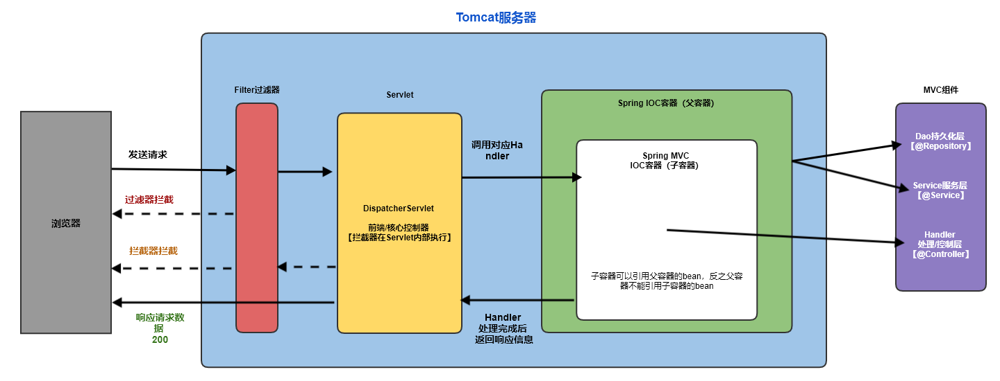

#### 一、Spring整合Spring MVC

##### 1. Spring IOC容器 和 Spring MVC IOC容器的关系

> Spring IOC 容器为父容器，Spring MVC IOC容器为子容器
>
> * 子容器可以引用父容器的bean，反之父容器不能引用子容器的bean；
> * Spring IOC容器引入`Dao & Service`层的bean对象；
> * Spring MVC IOC 容器引入`Controller | Handler`层的bean对象，同时可以使用`父容器Spring IOC`中的bean对象；
> * 请求调用顺序结构：Controller/Handler 控制/处理层 --> Service服务层 --> Dao持久化层

##### 2. 整合流程

目录结构

```tex
├── src                
|   ├── com.ss         
|   |   ├── beans          			bean对象
|   |   ├── handler        			控制器
|   |   ├── dao            			持久化层
|   |   └── servise        			服务层
|   ├── spring-ioc-config.xml   	SpringIOC容器配置
|   └── spring-mvc-ioc-config.xml   SpringMVCIOC容器配置
└── web
    ├── static           			静态资源【必须命名为static】
    ├── WEB-INF             		私密文件-浏览器无法直接访问
    |   ├── lib            			spring&第三方jar包
    |   ├── views            		jsp页面
    |   └── web.xml        			servlet配置文件
    └── index.jsp               	首页
```

**导入jar包**

```tex
spring-aop-4.0.0.RELEASE.jar
spring-beans-4.0.0.RELEASE.jar
spring-context-4.0.0.RELEASE.jar
spring-core-4.0.0.RELEASE.jar
spring-expression-4.0.0.RELEASE.jar
commons-logging-1.1.3.jar
spring-web-4.0.0.RELEASE.jar
spring-webmvc-4.0.0.RELEASE.jar
```

**开始整合**

第一步：添加Spring IOC 和 Spring MVC IOC 容器XML文件，添加如下配置：

spring-ioc-config.xml

```xml
    <!--  SpringIOC容器配置  -->
    <context:component-scan base-package="com.ss">
    <!--    排除扫描@Controller组件    -->
    <context:exclude-filter 
             type="annotation" 
             expression="org.springframework.stereotype.Controller"
    />
    </context:component-scan>
    <bean id="user" class="com.ss.beans.User">
        <property name="name" value="Curry"></property>
        <property name="skill" value="Three-Point"></property>
    </bean>
```

spring-mvc-ioc-config.xml

```xml
	<!-- Spring MVC IOC 容器配置 -->

    <!--    扫描注解组件，加载bean对象    -->
    <context:component-scan base-package="com.ss" use-default-filters="false">
        <!--           扫描过滤：只扫描标注@Controller注解的组件             -->
        <context:include-filter 
          	type="annotation"  
            expression="org.springframework.stereotype.Controller"
        /> 
    </context:component-scan>
    
    <!--  配置视图解析器  -->
    <bean class="org.springframework.web.servlet.view.InternalResourceViewResolver">
        <property name="prefix" value="/WEB-INF/views/"></property>
        <property name="suffix" value=".jsp"></property>
    </bean>
    <!--    配置静态资源    -->
    <mvc:default-servlet-handler/>
    <mvc:annotation-driven/>
```

第二步：配置Servlet，通过listener监听器监听Servlet初始化时，将Spring IOC容器整合到一起；

web.xml

```xml
<!--  整合SpringIOC容器  -->
    <!--  初始化SpringIOC容器  -->
    <context-param>
        <param-name>contextConfigLocation</param-name>
        <param-value>classpath:spring-ioc-config.xml</param-value>
    </context-param>
    <!--  配置监听器  -->
    <listener>
        <listener-class>org.springframework.web.context.ContextLoaderListener</listener-class>
    </listener>
<!--  整合SpringIOC容器End  -->

    <!--  配置前端/核心控制器  -->
    <servlet>
        <servlet-name>dispatcherServlet</servlet-name>
        <servlet-class>org.springframework.web.servlet.DispatcherServlet</servlet-class>
        <!--    指定该Servlet初始化加载的IOC容器    -->
        <init-param>
            <param-name>contextConfigLocation</param-name>
            <param-value>classpath:spring-mvc-ioc-config.xml</param-value>
        </init-param>
<!--        <load-on-startup>1</load-on-startup>-->
    </servlet>
    <servlet-mapping>
        <servlet-name>dispatcherServlet</servlet-name>
        <url-pattern>/</url-pattern>
    </servlet-mapping>
```


第三步：在com.ss.beans添加一个User Bean类，并且在com.ss.handler中添加一个UserHandler处理器。

User.java

```java
public class User {
    private String name;
    private String skill;
    //省略get、set、toString、有参无参构造器...
}
```


UserHandler.java

```java
@Controller
public class UserHandler {
    @RequestMapping("/testUser")
    public String handlerTestUser(HttpSession session){
        // 获取Spring IOC容器对象
        ServletContext sc = session.getServletContext();
        WebApplicationContext context = WebApplicationContextUtils.getWebApplicationContext(sc);
        User user = context.getBean("user", User.class);
        System.out.println("Spring IOC容器获取："+user);
        return "success";
    }
}
```


第四步：通过接收一个Get请求，测试在Handler方法中获取Spring IOC容器中的bean对象。

```tex
1.访问：http://localhost:8080/Tomcat项目名/testUser

2.在UserHandler handlerTestUser方法中打印Bean对象：
Spring IOC容器获取：User{name='Curry', skill='Three-Point'}
```


> 完整代码链接：https://github.com/LiJonsen/JavaDemo/tree/master/Spring/SSMIntegration/
>
> 流程示意图：
>
> 


#### 二、Spring整合Mybatis

