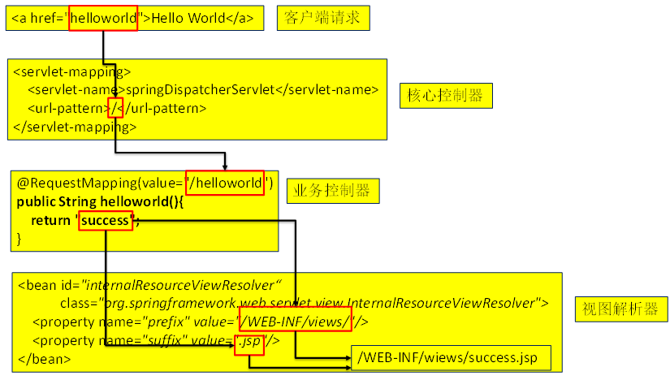
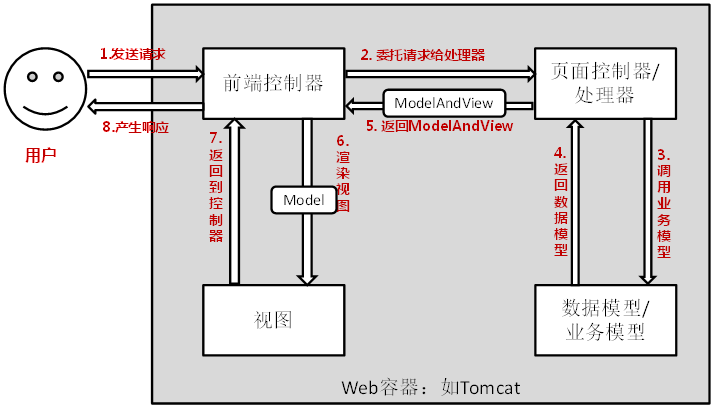
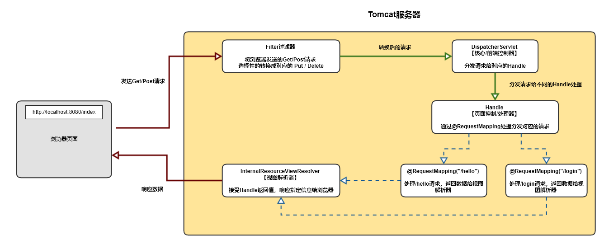
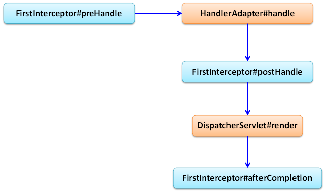
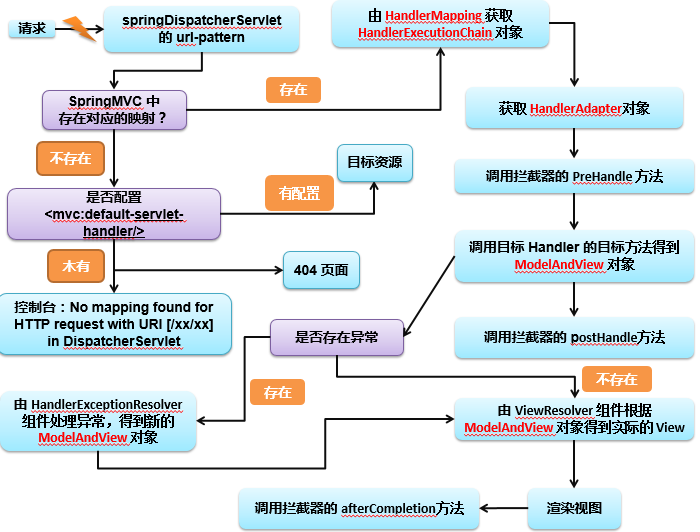

### Spring MVC 笔记

#### 一、概述

> 一种轻量级的、基于MVC的Web层应用框架。偏前端而不是基于业务逻辑层；
>
> 作用：
>
> 1） 天生与Spring框架集成，如：(IOC,AOP)
>
> 2） 支持Restful风格
>
> 3） 进行更简洁的Web层开发
>
> 4） 支持灵活的URL到页面控制器的映射
>
> 5） 非常容易与其他视图技术集成，如:Velocity、FreeMarker等等
>
> 6） 因为模型数据不存放在特定的API里，而是放在一个Model里(Map数据结构实现，因此很容易被其他框架使用)
>
> 7） 非常灵活的数据验证、格式化和数据绑定机制、能使用任何对象进行数据绑定，不必实现特定框架的API
>
> 8） 更加简单、强大的异常处理
>
> 9） 对静态资源的支持
>
> 10） 支持灵活的本地化、主题等解析


**主要的常用组件**

* DispatcherServlet：前端控制器 / 核心控制器；

* Controller：处理器/页面控制器，做的是MVC中的C的事情，但控制逻辑转移到前端控制器了，用于对请求进行处理；

* HandlerMapping：请求映射到处理器，找谁来处理，如果映射成功返回一个HandlerExecutionChain对象（包含一个Handler处理器(页面控制器)对象、多个HandlerInterceptor拦截器对象） ；

* View Resolver : 视图解析器，找谁来处理返回的页面。把逻辑视图解析为具体的View,进行这种策略模式，很容易更换其他视图技术；
  * 如：InternalResourceViewResolver将逻辑视图名映射为JSP视图；

* LocalResolver：本地化、国际化；

* MultipartResolver：文件上传解析器；

* HandlerExceptionResolver：异常处理器；


#### 二、Helloworld

##### 2.1 新建web工程，导入jar包

> 配置Tomcat服务器，在WEB-INF下创建lib目录存放jar包

```tex
spring-aop-4.0.0.RELEASE.jar
spring-beans-4.0.0.RELEASE.jar
spring-context-4.0.0.RELEASE.jar
spring-core-4.0.0.RELEASE.jar
spring-expression-4.0.0.RELEASE.jar
commons-logging-1.1.3.jar

spring-web-4.0.0.RELEASE.jar
spring-webmvc-4.0.0.RELEASE.jar
```


##### 2.2 在web.xml中配置核心控制器

```xml
 <!--  配置前端控制器/核心控制器  -->
<servlet>
        <servlet-name>dispatcherServlet</servlet-name>
        <servlet-class>org.springframework.web.servlet.DispatcherServlet</servlet-class>
        <!--    指定该Servlet初始化加载的IOC容器    -->
        <init-param>
            <param-name>contextConfigLocation</param-name>
            <param-value>classpath:spmvc-helloworld-config.xml</param-value>
        </init-param>
        <!--
             load-on-startup: 设置DispatcherServlet在服务器启动时加载。
             Servlet的创建时机：
                              1. 请求到达以后创建
                              2. 服务器启动即创建
         -->
        <load-on-startup>1</load-on-startup>
    </servlet>
    <servlet-mapping>
        <servlet-name>dispatcherServlet</servlet-name>
        <url-pattern>/</url-pattern>
</servlet-mapping>
```


##### 2.3 配置IOC容器

spmvc-helloworld-config.xml

```xml
    <!--  组件扫描  -->
	<context:component-scan base-package="com.hello_spmvc"/>

    <!--
        配置视图解析器InternalResourceViewResolver

        		 工作机制:  prefix + 请求处理方法的返回值 + suffix  =  物理视图路径.
		 		 /WEB-INF/views/success.jsp

		WEB-INF: 是服务器内部路径。 不能直接从浏览器端访问该路径下的资源. 但是可以内部转发进行访问
    -->

    <bean class="org.springframework.web.servlet.view.InternalResourceViewResolver">
        <!--   拼接物理视图路径     -->
        <property name="suffix" value=".jsp"></property>
        <property name="prefix" value="/WEB-INF/views/"></property>
    </bean>
```

##### 2.4 编写处理请求的处理器，并标识为处理器

> 此时必须声明为@Controller组件

```java
@Controller
public class HelloWorldHandle {
    /**
     * 映射请求的名称：用于客户端请求；类似Struts2中action映射配置的action名称
     * 1. 使用 @RequestMapping 注解来映射请求的 URL
     * 2. 返回值会通过视图解析器解析为实际的物理视图, 对于 InternalResourceViewResolver 视图解析器,
     * 会做如下的解析:
     *               通过 prefix + returnVal + suffix 这样的方式得到实际的物理视图, 然后做转发操作.
     *               /WEB-INF/views/success.jsp
     */
    @RequestMapping("hello")
    public String helloWorld(){
        System.out.println("run helloWorld handle...");

        return "success";
    }
}
```

##### 2.5 添加测试jsp文件

index.jsp（首页）

```jsp
<%@ page contentType="text/html;charset=UTF-8" language="java" %>
<html>
  <head>
    <title>Heelo spmvc</title>
  </head>
  <body>
    <!-- 
		在2.4请求处理器中接受该请求后，跳转到当前工程的hello.jsp页面 
			
			1.注解@RequestMapping("hello")标识的方法返回"success"字符串
			2.访问视图解析器配置路径：/WEB-INF/views/success.jsp
	-->
    <a href="hello">跳转hello.jsp</a>
  </body>
</html>
```


success.jsp （要跳转的jsp）

```jsp
<%@ page contentType="text/html;charset=UTF-8" language="java" %>
<html>
<head>
    <title>Success Page</title>
</head>
<body>
    <h3>Success Page...</h3>
</body>
</html>
```


##### 2.6 启动Tomcat服务器，测试跳转功能

请求流程示意图



流程分析示意图







#### 三、@RequestMapping

> 作用：为控制器指定要处理的请求URL；
>
> 在控制器的类定义及方法定义处都可标注 @RequestMapping
>
> * 标记在类上：提供初步的请求映射信息。相对于  WEB 应用的根目录；
>
> * 标记在方法上：提供进一步的细分映射URL信息，相对于标记在类上的 URL，如果当前类没有标记则相对于WEB应用根目录；

@RequestMapping注解参数

* value：要处理的请求URL；
* method：处理请求的方法，可以为多个`method = {RequestMethod.POST,RequestMethod.GET}`。
* params：指定要接收的请求参数；
* headers：指定接收的请求头信息；


```java
@RequestMapping(
    value="/testRequestMappingMethod",
    method= RequestMethod.POST,
    params={name="root",password="root"}
    headers={"!Accept-Language"}
)
public String handlerRequest(){
    //...
}
```


#### 四、处理请求数据

> * Spring MVC 通过分析处理方法的签名，HTTP请求信息绑定到处理方法的相应人参中。
>   * 方法签名：`方法的名字+方法的参数列表`；
>
> * 必要时可以对方法及方法入参标注相应的注解`（ @PathVariable 、@RequestParam、@RequestHeader 等）`;
>
> * Spring MVC 框架会将 HTTP 请求的信息绑定到相应的方法入参中，并根据方法的返回值类型做出相应的后续处理。


##### 4.1 @RequestParam注解

> 作用：处理方法形参处使用`@RequestParam`注解，可以把请求参数传递给当前标注的请求方法；
>
> 参数：
>
> * value：参数名
> * required：是否必须【默认为true】
> * defaultValue：默认值【设置当前形参默认值】


```java
   @RequestMapping(value = "/testParams",method = RequestMethod.GET)
    public String handleParams(
            @RequestParam(value = "username") String username,
            @RequestParam(value = "age",required = false,defaultValue = "0") int age
    ){
        System.out.println(username+","+age);
        return "success";
    }
```


##### 4.2 @RequestHeader注解

> 作用：使用`@RequestHeader`注解可以获取请求头信息；

```java
//映射请求头信息
@RequestMapping(value="/testRequestHeader")
public String testRequestHeader(@RequestHeader(value="Accept-Language") String al){
	System.out.println("testRequestHeader - Accept-Language："+al);
	return "success";
}
```

##### 4.3 @CookieValue注解

> 作用：获取请求的Cookie信息

```java
@RequestMapping("/testCookieValue")
public String testCookieValue(@CookieValue("JSESSIONID") String sessionId) {
	System.out.println("testCookieValue: sessionId: " + sessionId);
	return "success";
}
```

##### 4.4 @PathVariable注解

> 作用：获取带占位符的动态URL；

```java
	/**
	 * 带占位符的URL
	 * 浏览器:  http://localhost:8888/Springmvc01/testPathVariable/admin/1001
	 */
	@RequestMapping(value="/testPathVariable/{name}/{id}")
public String testPathVariable(
    	@PathVariable("name")String name,
    	@PathVariable("id")Integer id 
) {
		System.out.println(name  + " : " + id);
		return "success";
}
```

##### 4.5 使用Servlet原生API作为参数

> MVC的Handler方法可以接收哪些ServletAPI类型的参数？

1) HttpServletRequest

2) HttpServletResponse

3) HttpSession

4) java.security.Principal

5) Locale

6) InputStream

7) OutputStream

8) Reader

9) Writer


#### 五、响应JSON & 文件上传


##### 5.1 配置响应JSON

> 添加以下jar包到项目【下载地址：http://wiki.fasterxml.com/JacksonDownload/  】
>
> jackson-annotations-2.1.5.jar
>
> jackson-core-2.1.5.jar
>
> jackson-databind-2.1.5.jar

```java
    /**
     * @ResponseBody - 该注解支持响应Json
     * 响应Get/Post请求，返回Json格式数据
     * @return
     */
    @ResponseBody
    @RequestMapping(value = "/testJson",method = RequestMethod.GET)
    public Collection<Employee> responseJson(){
        return employeeDao.getList();
    }
```


##### 5.2 实现文件上传

> 添加以下jar包到当前项目
>
> commons-fileupload-1.2.1.jar
>
> commons-io-2.0.jar

配置文件上传解析器

> 注意：id必须为`multipartResolver`，因为jar包源码默认设置了默认获取id值等于`multipartResolver`的bean对象；

```xml
    <!--  配置common-fileupload接收客户端上传的文件  -->
    <bean id="multipartResolver" class="org.springframework.web.multipart.commons.CommonsMultipartResolver">
        <property name="defaultEncoding" value="UTF-8"></property>
        <property name="maxUploadSize" value="1024000"></property>
    </bean>
```

上传示例

```html
    <%--  测试上传文件  --%>
    <form action="uploadImg" method="post" enctype="multipart/form-data">
      <input type="file" name="file" />
      <input type="text" name="desc"/>
      <input type="submit" value="Upload Image"/>
    </form>
```

```java
	 /**
     * 接收浏览器上传的图片文件
     * @return
     */
    @RequestMapping(value = "/uploadImg",method = RequestMethod.POST)
    public String uploadImageHandler(
            @RequestParam("file") MultipartFile file,
            @RequestParam(value = "desc",required = false) String desc,
            HttpSession session
    ) throws IOException {
        String name = file.getOriginalFilename();
//        InputStream is = file.getInputStream();
        //获取服务器端的static文件夹的真实路径。
        String realPath = session.getServletContext().getRealPath("static");
        // 注意：如果文件夹不存在不会自动创建
        File out_file = new File( realPath+ "/" + name);
        // 将文件保存到Tomcat服务器本地
        file.transferTo(out_file);
        System.out.printf("Filename=%s\tDesc=%s",name,desc);
        return "success";
    }
```


#### 六、拦截器

##### 6.1 拦截器概述

> 作用：可以通过自定义拦截器对请求进行拦截处理，实现一些特定的功能/业务需求；
>
> 【自定义的拦截器可以实现`HandlerInterceptor接口`，或者可以继承`HandlerInterceptorAdapter适配器类`】

实现方法作用描述：

* boolean preHandle()
  * 在业务处理器处理请求之前被调用，可以在该方法中对用户请求request进行处理；
  * return true：继续往下执行其他拦截器或代码；
  * truen false：进行拦截，不会调用其他组件去处理请求，阻止代码继续往下执行；
* void postHandle()
  * 在业务处理器处理完请求后，在`DispatcherServlet（核心控制器）`向客户端返回响应前被调用；
  * 
* void afterCompletion()
  * 在`DispatcherServlet（核心控制器）`完全处理完请求后被调用；
  * 在该方法可以做一些资源清理的操作；


拦截器执行顺序




##### 6.2 定义单个拦截器

第一步：自定义一个`HandlerInterceptor`实现类`MyFirstInterceptor`

```java
/**
 * @ClassName MyFirstInterceptor
 * @Description 我的第一个自定义拦截器
 * @Author Josen
 * @Create 2020/7/31 11:30
 */
public class MyFirstInterceptor implements HandlerInterceptor {
    /**
     * 1. 是在DispatcherServlet的939行   在请求处理方法之前执行
     */
    @Override
    public boolean preHandle(HttpServletRequest httpServletRequest, HttpServletResponse httpServletResponse, Object o) throws Exception {
        System.out.println("Run preHandle");
        return true;
    }
    /**
     * 2. 在DispatcherServlet 959行   请求处理方法之后，视图处理之前执行。
     */
    @Override
    public void postHandle(HttpServletRequest httpServletRequest, HttpServletResponse httpServletResponse, Object o, ModelAndView modelAndView) throws Exception {
        System.out.println("Run postHandle");

    }
    /**
     * 3.
     * 	 [1].在DispatcherServlet的 1030行   视图处理之后执行.(转发/重定向后执行)
     * 	 [2].当有多个拦截器时，某个拦截器的preHandle返回false后，
     * 	     也会执行当前拦截器之前拦截器的afterCompletion
     */
    @Override
    public void afterCompletion(HttpServletRequest httpServletRequest, HttpServletResponse httpServletResponse, Object o, Exception e) throws Exception {
        System.out.println("Run afterCompletion");
    }
}
```

第二步：添加自定义拦截器配置

```xml
    <!--  配置自定义拦截器  -->
    <mvc:interceptors>
        <!--   1. 拦截所有请求     -->
        <bean id="firstInterceptor" class="com.interceptor.MyFirstInterceptor"></bean>

        <!-- 2. 指定拦截 或者指定不拦截
            <mvc:interceptor>
                <mvc:mapping path="/emps"/>
                <mvc:exclude-mapping path="/emps"/>
                <bean class="com.interceptor.MyFirstInterceptor"></bean>
                <ref bean="firstInterceptor"/>
            </mvc:interceptor>
        -->
    </mvc:interceptors>
```

第三步：测试拦截器调用顺序

```java
// Handler处理器
@Controller
public class InterceptorHandler {
    @RequestMapping(value = "testInterceptor")
    public String handlerInterceptorRequest(){
        System.out.println("接收到testInterceptor请求...");
        return "success";
    }
}
```

```tex
// 访问：http://localhost:8080/sp_mvc/testInterceptor

// 打印执行顺序如下：
Run preHandle
接收到testInterceptor请求...
Run postHandle
Run afterCompletion
```


#### 总结

* 滤器与拦截器的区别：

  * 过滤器：在Servlet之前执行；
  * 拦截器：在Servlet内部执行，先执行过滤器；

* 请求重定向与转发的区别

  * 重定向：浏览器首次请求返回304状态码，浏览器识别到304状态码后，再次发送重定向的地址请求【总共发送了两次请求】；
  * 请求转发：从发送请求开始到结束只有一次请求；

* 配置Servlet静态资源访问

  * 在SpringMVC的配置文件中添加配置

  * ```xml
    <!--  配置访问静态资源  -->
    <mcv:default-servlet-handler/>
    <!--  
    	配置view-controller、default-servlet-handler必须添加annotation-driven标签  
    -->
    <mvc:annotation-driven/>
    ```

* `<mvc:default-servlet-handler/>`作用：
  * 配置加载Tomcat静态资源文件；
  * 需要添加`<mvc:annotation-driven/>`配置；
  * web目录下，静态资源必须存放在`static`目录中，放置其它目录会导致无法访问；
* Spring MVC处理请求执行流程示意图：



