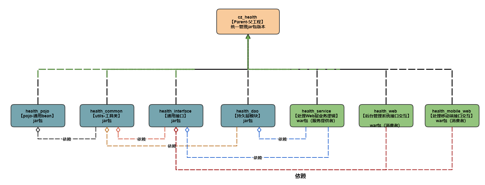

## 传智健康项目

### 项目结构（SOA 面向服务架构）

```
├── health_common    		存放项目中通用的工具类和常量类（jar）
├── health_dao               持久层模块，存放Dao接口和Mapper映射文件等（jar）
├── health_interface 		存放服务接口，用于dubbo在服务提供者和服务消费者中使用。（jar）
├── health_pojo              存放bean实体类和返回结果类等（jar）
├── health_service 			Dubbo服务提供者，存放服务实现类，作为服务提供方，需要部署到tomcat运行（war）
├── health_mobile_web		Dubbo服务消费者、移动端Controller层（war）
└── health_web    			Dubbo服务消费者、后台管理系统Controller层（war）
```



